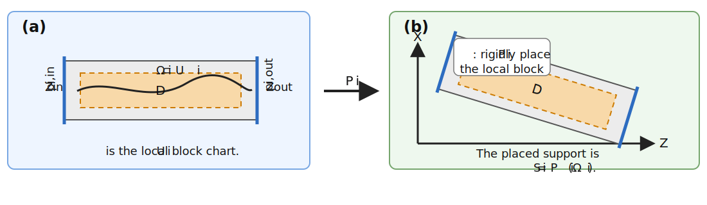
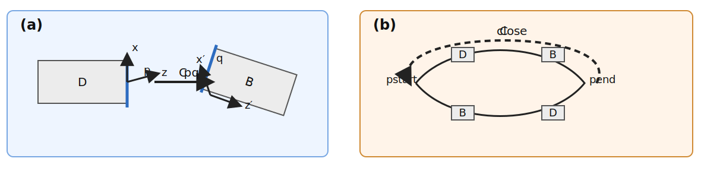

## Geometric Background

This section records the small amount of differential-geometric and
fibre-bundle language used in the placement discussion. The point, following
Forest and Hirata [@foresthirata], is to separate the placed object from any
one chosen coordinate description.

### The bookkeeping base

Let $\mathcal B$ denote the *reference base* used for ordering and reporting.
For a transfer line, $\mathcal B$ may be an interval. For a ring,
$\mathcal B$ may be a circle. For a machine whose reference-order topology
contains a junction, an extraction line, a splitter, or a switchyard,
$\mathcal B$ may be a graph with labeled edges and junction nodes.

The important point is that $\mathcal B$ is a bookkeeping base, not the full
physical geometry.

::: {.content-visible when-format="html"}
{#fig-coordinate-reference-base width="100%"}
:::

::: {.content-visible when-format="pdf"}
```{=latex}
\begin{figure}[htbp]
\centering
\input{physics/coordinate-systems/figures/tikz/reference-base.tikz.tex}
\caption{Examples of the bookkeeping base $\mathcal B$: (a) interval, the reference base for an open line; (b) circle, the reference base for a ring; and (c) graph with junctions, appropriate for a switchyard, splitter, or extraction topology. The same placement formalism can sit over all three.}
\end{figure}
```
:::

### Local charts and supports

An individual element is described locally by a chart

$$
\psi_i:U_i\to\mathbb{R}^3 ,
$$

where $U_i$ is the canonical local coordinate domain of element $i$. The subset

$$
\Omega_i\subset U_i
$$

is the local support on which the field, aperture, material, or map model is
defined. The local block picture is not yet the lab-frame placement. A
placement map $P_i$ rotates and translates that local description into the
laboratory frame.

::: {.content-visible when-format="html"}
{#fig-coordinate-local-placement width="100%"}
:::

::: {.content-visible when-format="pdf"}
```{=latex}
\begin{figure}[htbp]
\centering
\input{physics/coordinate-systems/figures/tikz/local-placement.tikz.tex}
\caption{Local versus placed descriptions of an element: (a) a local chart with support $\Omega_i\subset U_i$ and ports $p_{i,\mathrm{in}}$ and $p_{i,\mathrm{out}}$; and (b) the corresponding placement in laboratory space obtained by the rigid placement map $P_i$.}
\end{figure}
```
:::

### Ports

A *port* is a distinguished interface chart on the boundary of that support. If

$$
\Sigma_{i,\alpha}\subset\partial\Omega_i
$$

is a marked boundary patch and $F_{i,\alpha}$ is an adapted frame attached to
that patch, then

$$
p_{i,\alpha}=(\Sigma_{i,\alpha},F_{i,\alpha})
$$

is a port of the element.

In the simplest case the ports are just the entrance and exit faces.
Junctions, splitters, extraction devices, or ring closures introduce
additional named interface charts, but they do not change the basic definition.

::: {.content-visible when-format="html"}
{#fig-coordinate-ports-closure width="100%"}
:::

::: {.content-visible when-format="pdf"}
```{=latex}
\begin{figure}[htbp]
\centering
\input{physics/coordinate-systems/figures/tikz/ports-closure.tikz.tex}
\caption{Ports, gluing, and closure: (a) port-to-port gluing via the transition map or patch transform $C_{pq}$; and (b) transition from port $p$ to port $q$ or closure around a ring, where the residual closure transform may satisfy $C_{\mathrm{close}} \neq I$.}
\end{figure}
```
:::

### Transition maps and closure

When two local descriptions are joined, the relevant datum is a transition map
between charts. On an overlap or a common interface one may write

$$
g_{ij}=P_i^{-1}\circ P_j .
$$

If the connection is localized to named ports $p$ and $q$, the same datum can
be stored as a rigid port-to-port patch transform $C_{pq}$. In that sense, the
port notion is not an additional physical ingredient. It is the
implementation-level representative of a chosen interface chart.

This language is particularly useful for rings. Transporting local frames
around a full loop need not return one to the original frame with the identity
transform. The residual closure transform is part of the geometry. This is the
fibre-bundle point emphasized by Forest and Hirata: one should not force one
global chart when the machine is naturally assembled from local ones
[@foresthirata].
