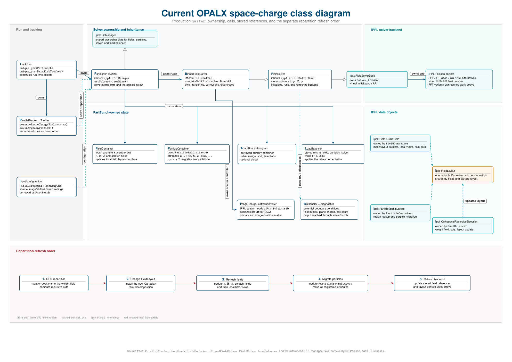

This chapter is the physics-level counterpart to the
[Field Solver user guide](../../user-guide/field-solver/index.qmd). The user
guide documents input choices and current runtime behavior; this chapter will
derive the model, state its approximations, and collect numerical validation.

::: {.callout-note title="Documentation skeleton"}
The headings below define the intended scope. They deliberately contain only
short writing prompts so that equations and claims can be added after they are
checked against the implementation and benchmark cases.
:::

## Scope and notation {#field-solver-scope}

Define the charge, field, coordinate, unit, and sign conventions used throughout
the chapter. State which parts apply to all solvers and which are specific to
space charge.

## Governing electrostatic model {#governing-electrostatic-model}

State the quasi-static approximation and the physical problem solved in the
selected bunch frame.

### Poisson equation {#poisson-equation}

Introduce the source term, potential, electric field, and boundary data.

### Self-field force {#self-field-force}

Connect the solved fields to the force applied by the tracker, including any
frame transformation required before the particle push.

## Particle-mesh discretization {#particle-mesh-discretization}

Describe the complete particle-in-cell cycle and identify the discrete
quantities that live on particles and on the mesh.

### Charge deposition {#charge-deposition}

Specify the particle shape, weighting rule, normalization, and treatment of
ghost cells.

### Mesh solve {#mesh-solve}

Define the discrete Poisson operator or convolution used by each solver family.

### Field reconstruction and interpolation {#field-reconstruction}

Explain how the electric field is reconstructed and interpolated back to
particle positions.

## Frames and relativistic transformations {#frames-transformations}

Derive the transformations between the laboratory frame, mean rest frame, and
bin-local frames. State where approximations enter.

## Boundary conditions and Green functions {#physics-boundary-conditions}

Define each boundary-value problem independently of its input syntax.

### Periodic boundaries {#physics-periodic-boundaries}

Describe the periodic domain, compatibility conditions, and zero-mode handling.

### Open boundaries {#physics-open-boundaries}

Derive the free-space Green-function convolution and doubled-domain method.

### Dirichlet and image-charge boundaries {#physics-dirichlet-boundaries}

Explain explicit image-charge and shifted-Green constructions, including the
geometries and assumptions for which they are valid.

## Solver formulations {#solver-formulations}

Relate the mathematical problem to the available numerical backends.

### Periodic FFT solver {#physics-fft-solver}

Document the spectral formulation, differentiation, normalization, and
parallel decomposition.

### Hockney open-boundary solver {#physics-open-solver}

Document domain doubling, kernel sampling, padding, and extraction of the
physical-domain result.

### Iterative solvers {#physics-iterative-solvers}

Reserve this subsection for the operator, convergence criterion,
preconditioning, and supported boundary conditions once an iterative backend
is production-ready.

## Binned rest-frame space charge {#physics-binned-space-charge}

Derive the longitudinal binning approximation, bin-frame transforms, per-bin
solve, and accumulation of the resulting fields.

## Emission and conducting boundaries {#physics-emission-boundaries}

Describe how emission time, cathode geometry, image charges, and activation of
space charge interact.

## Numerical accuracy and convergence {#numerical-accuracy-convergence}

Collect the error sources that should be varied in convergence studies.

### Mesh resolution {#mesh-resolution}

Define spatial refinement studies and expected convergence observables.

### Particle noise and deposition order {#particle-noise}

Separate sampling noise from mesh and solver error.

### Time-step coupling {#time-step-coupling}

Explain how field-solve frequency, particle stepping, and emission updates
couple to the spatial solve.

## Domain decomposition and load balancing {#domain-decomposition}

Explain which mathematical data are repartitioned and why the field, particle,
and solver state must be refreshed in a defined order.

## Current implementation architecture {#field-solver-architecture}

The following diagram is retained as TikZ source for PDF output. HTML uses a
small generated PNG of the same source so the page does not depend on a
browser-side TikZ renderer.

::: {#fig-current-space-charge-class-diagram}
:::: {.content-visible when-format="html"}
{fig-alt="Current OPALX space-charge class diagram"}
::::

:::: {.content-visible when-format="pdf"}

::::

Current OPALX space-charge class relationships and repartition refresh order.
The editable source is `figures/current-space-charge-class-diagram.tex`.
:::

## Verification and benchmarks {#field-solver-verification}

List analytic solutions, manufactured solutions, regression cases, conserved
quantities, and cross-code comparisons required for each solver mode.

## Assumptions and known limitations {#field-solver-limitations}

Maintain a concise list of model assumptions, unsupported combinations, and
known numerical limitations, with links to reproducible investigations.
