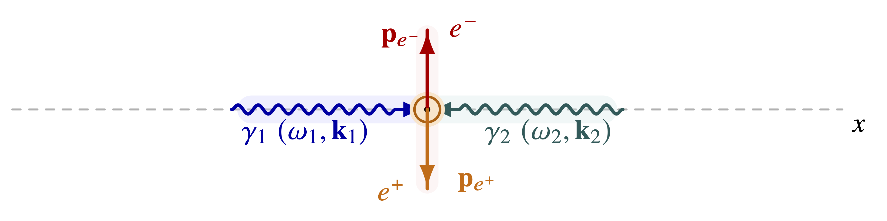

### Scope {#sec-bw-scope}

This note describes the minimum Breit-Wheeler physics model needed for
the next *OPALX* benchmark.

::: {.content-visible when-format="html"}
{fig-alt="Breit-Wheeler scattering" width="85%"}
:::

```{=latex}
\begin{figure}[htbp]
\centering
\input{physics/gamma-gamma/figures/tikz/breit_wheeler_qed_style_tikz.tikz.tex}
\caption{Breit-Wheeler scattering.}
\end{figure}
```

We follow closely the CAIN ansatz i.e. manual and source code.

The goal is not yet a full tracking implementation. The immediate target
is a host-side Monte Carlo and deterministic benchmark path that
reproduces CAIN for the process

$$\gamma + \gamma \rightarrow e^- + e^+ .$$

The first benchmark will follow the same strategy as the linear ICS
work:

- start from a fixed-geometry, unpolarized, linear process;

- implement the core event kernel in;

- validate deterministic and sampled spectra against CAIN;

- delay bunch population and tracker integration until the kernel is
  trusted.

### Linear Breit-Wheeler Kinematics in CAIN {#_linear_breit_wheeler_kinematics_in_cain}

CAIN's linear generator `LNBWGN` uses two incoming photons:

- a laser photon with energy $W_1$ and direction $\mathbf{n}_1$,

- a high-energy photon with energy $W_2$ and direction $\mathbf{n}_2$.

Note: in a collider setup the laser photon is also a high-energy photon.

The opening-angle dependence enters through

$$Z_0 = \mathbf{n}_1 \cdot \mathbf{n}_2 .$$

The two-photon invariant used in CAIN is

$$
S_0 = 2 W_1 W_2 (1 - Z_0) .
$$ {#eq-bw-cain-s0}

Pair creation is kinematically allowed only if

$$
S_0 \ge 4 m_e^2 .
$$ {#eq-bw-threshold}

This threshold appears directly in `LNBWGN`:

``` fortran
S0=2*W1*W2*(1-Z0)
IF (4*M**2.GT.S0) GOTO 900
```

In a head-on geometry, $Z_0 = -1$, so the threshold reduces to

$$
W_1 W_2 \ge m_e^2 .
$$ {#eq-bw-headon-threshold}

This is the cleanest geometry for the first benchmark.

CAIN constructs the center-of-momentum boost velocity from the two
incoming photon momenta and then samples the final-state scattering
variables in that frame.

The code introduces a transformed photon energy $W$ and several
auxiliary variables:

$$
W = \gamma W_1 V_R,
\qquad
X = \frac{\sqrt{W^2 - m_e^2}}{W},
\qquad
X_1 = \frac{m_e^2}{W^2 + W\sqrt{W^2 - m_e^2}} .
$$ {#eq-bw-cain-aux}

The random variable $Y$ is used to generate the CM scattering angle
through

$$
\cos\theta = 1 - 2Y .
$$ {#eq-bw-cain-costh}

The resulting Mandelstam-like combinations in the CAIN implementation
are

$$
s_m = \frac{2m_e^2}{(1+X)X_1}\left[X(1-2Y)-1\right],
\qquad
u_m = -\frac{2m_e^2}{(1+X)X_1}\left[X(1-2Y)+1\right] .
$$ {#eq-bw-cain-sm-um}

CAIN then builds the angular kernel from

$$
\cos\theta_1 = 1 + 2m_e^2\left(\frac{1}{u_m} + \frac{1}{s_m}\right)
$$ {#eq-bw-cain-costh1}

and

$$
D = -\left(\frac{s_m}{u_m} + \frac{u_m}{s_m}\right) .
$$ {#eq-bw-cain-d}

For unpolarized incoming photons, the acceptance weight reduces to the
unpolarized part of the full CAIN expression.

### OPALX Validation Path {#_opalx_validation_path}

##### Deterministic physics helper

- [x] add `Physics::LinearBreitWheeler`

- [x] implement threshold and invariant helpers

- [x] implement deterministic spectra from the linear kernel

##### Host-only sampled event generator

- [x] fixed seed through `Options::seed`

- [x] return one sampled electron-positron pair per accepted event

- no tracker, no photon bunch population, no GPU path yet

##### CAIN comparison

- [x] generate a CAIN reference deck in the same style as the
  linear-Compton notes

- [x] compare OPALX and CAIN histograms first in 1D, later in 2D

### Implemented OPALX Benchmark {#sec-bw-implemented-opalx-benchmark}

The current *OPALX* implementation is covered by the generated
[API reference](../../reference/api.qmd). The implementation and tests are in
these source files:

- [`src/Physics/LinearBreitWheeler.h`](/blob/master/src/Physics/LinearBreitWheeler.h)

- [`src/Physics/LinearBreitWheeler.cpp`](/blob/master/src/Physics/LinearBreitWheeler.cpp)

- [`unit_tests/Physics/TestLinearBreitWheeler.cpp`](/blob/master/unit_tests/Physics/TestLinearBreitWheeler.cpp)

- [`unit_tests/Physics/LinearBreitWheelerBenchmarkCommon.h`](/blob/master/unit_tests/Physics/LinearBreitWheelerBenchmarkCommon.h)

- [`unit_tests/Physics/LinearBreitWheelerBenchmark.cpp`](/blob/master/unit_tests/Physics/LinearBreitWheelerBenchmark.cpp)

- [`unit_tests/Physics/TestLinearBreitWheelerSpectrum.cpp`](/blob/master/unit_tests/Physics/TestLinearBreitWheelerSpectrum.cpp)

- [`generate-gamma-gamma-results.sh`](scripts/generate-gamma-gamma-results.sh)

- `~/git/cain/linear-breit-wheeler-head-on.i`

- `~/git/cain/generate-linear-breit-wheeler-results.sh`

The benchmark remains deliberately narrow:

- no tracker integration,

- no bunch population,

- no GPU path.

The validated observables are now:

- [x] electron energy spectrum,

- [x] positron energy spectrum,

- [x] electron angle spectrum,

- [x] positron angle spectrum,

- [x] joint $E$ vs. $\theta$ spectrum for the electron,

- [x] joint $E$ vs. $\theta$ spectrum for the positron.

Finite incoming-photon-beam benchmark:

- [x] electron energy spectrum with Gaussian photon-beam divergence,

- [x] positron energy spectrum with Gaussian photon-beam divergence,

- [x] electron angle spectrum with Gaussian photon-beam divergence,

- [x] positron angle spectrum with Gaussian photon-beam divergence.

The finite-photon-beam extension is still intentionally narrow:

- the high-energy photon beam is sampled only in momentum space,

- the reference beam axis is the head-on direction,

- the angular spread is Gaussian with
  $\sigma_{\theta x} = \sigma_{\theta y} = 1\,\mathrm{mrad}$,

- the current published benchmark keeps the photon-beam relative energy
  spread at zero,

- there is still no transverse position spread or laser-overlap
  weighting in the *OPALX* benchmark path.

#### Local Kernel Tests {#_local_kernel_tests}

The current *OPALX* implementation now exposes the same
proposal-coordinate view used by the CAIN rejection sampler. Two helper
functions are validated directly in the unit tests:

- the map from the proposal variable $z \in [-1,1]$ to the
  center-of-momentum scattering cosine $\cos\theta$,

- the corresponding unpolarized local angular weight in the same
  proposal coordinate.

This gives a direct check of the differential kernel itself, not only of
its integrated or sampled consequences. The pointwise tests use an
independent reference implementation of the CAIN-aligned auxiliary
variables $Y(z)$, $s_m$, $u_m$, and the local acceptance weight.

#### Finite-Photon-Beam Folding Algorithm {#_finite_photon_beam_folding_algorithm}

For the finite incoming-photon-beam benchmark, *OPALX* keeps the laser
photon fixed and samples only the high-energy photon beam. For each
event:

1.  a high-energy photon direction is drawn from a Gaussian angular
    spread around the head-on reference axis,

2.  the photon energy is either kept fixed or, in the extended code
    path, drawn from a Gaussian relative energy spread,

3.  a per-event linear Breit-Wheeler sampling kernel is built from that
    sampled incoming photon state and the fixed laser photon,

4.  the electron-positron event is generated with the same host-side
    rejection sampler used in the fixed-geometry benchmark,

5.  the requested observable is histogrammed and compared to the
    matching CAIN reference.

The present published finite-photon-beam result validates only the
divergence broadening. The next benchmark extensions are:

- joint $E$\--$\theta$ maps for the finite incoming photon beam,

- finite-photon-beam benchmarks with nonzero photon-beam relative energy
  spread.

### Results of Code Comparison {#sec-bw-results-of-code-comparison}

The current CAIN-backed *OPALX* benchmark compares the linear
unpolarized process `LASERQED` `BREITWHEELER,` `NPH=0` for a weak-field
setup with $\xi = 0.25$. The benchmark observables are:

- electron energy spectrum,

- positron energy spectrum,

- electron angle spectrum,

- positron angle spectrum,

- joint $E$ vs. $\theta$ maps for electron and positron,

- and, in the extended benchmark, the same 1D observables for a finite
  incoming photon beam.

The first fixed-geometry comparison point uses:

- head-on geometry,

- $E_\gamma = 0.5\,\mathrm{GeV}$,

- $\lambda_L = 1\,\mathrm{nm}$,

- unpolarized photons.

With the current *OPALX* Monte Carlo benchmark and the stored CAIN
references, the agreement is already tight.

Electron:

- [x] energy spectrum: mean-energy difference about `0.09%`, $L_1$ about
  `0.0179`

- [x] angle spectrum: mean-angle difference about `0.02%`, $L_1$ about
  `0.0176`

- [x] joint $E$\--$\theta$ map: mean-energy difference about `0.10%`,
  mean-angle difference about `0.02%`, $L_1$ about `0.0281`

Positron:

- [x] energy spectrum: mean-energy difference about `0.10%`, $L_1$ about
  `0.0160`

- [x] angle spectrum: mean-angle difference about `0.08%`, $L_1$ about
  `0.0173`

- [x] joint $E$\--$\theta$ map: mean-energy difference about `0.10%`,
  mean-angle difference about `0.08%`, $L_1$ about `0.0266`

So the present benchmark already supports both 1D and 2D CAIN-backed
regression coverage for the linear unpolarized kernel.

Finite incoming-photon-beam point:

- head-on reference geometry,

- $E_\gamma = 0.5\,\mathrm{GeV}$,

- $\lambda_L = 1\,\mathrm{nm}$,

- Gaussian photon-beam divergence with
  $\sigma_{\theta x} = \sigma_{\theta y} = 1\,\mathrm{mrad}$,

- zero photon-beam energy spread.

Finite-photon-beam agreement:

Electron:

- [x] energy spectrum: mean-energy difference about `0.12%`, $L_1$ about
  `0.0536`

- [x] angle spectrum: mean-angle difference about `2.49%`, $L_1$ about
  `0.0784`

- [x] joint $E$\--$\theta$ map: mean-energy difference about `0.11%`,
  mean-angle difference about `2.77%`, $L_1$ about `0.4416`

Positron:

- [x] energy spectrum: mean-energy difference about `0.13%`, $L_1$ about
  `0.0535`

- [x] angle spectrum: mean-angle difference about `2.89%`, $L_1$ about
  `0.0696`

- [x] joint $E$\--$\theta$ map: mean-energy difference about `0.07%`,
  mean-angle difference about `2.58%`, $L_1$ about `0.4230`

Finite-photon-beam plus energy-spread agreement:

Electron:

- [x] energy spectrum with photon-beam relative energy spread `1.0e-3`:
  mean-energy difference about `0.55%`, $L_1$ about `0.0573`

- [x] angle spectrum with photon-beam relative energy spread `1.0e-3`:
  mean-angle difference about `2.36%`, $L_1$ about `0.0822`

Positron:

- [x] energy spectrum with photon-beam relative energy spread `1.0e-3`:
  mean-energy difference about `0.55%`, $L_1$ about `0.0601`

- [x] angle spectrum with photon-beam relative energy spread `1.0e-3`:
  mean-angle difference about `2.59%`, $L_1$ about `0.0721`

The finite-photon-beam angle benchmarks are intentionally windowed to
$0 \le \theta \le 6\,\mathrm{mrad}$, so the stored CAIN angular
histograms do not integrate to exactly one inside that clipped range.

The fixed-geometry head-on comparisons are shown for the electron in
@fig-bw-headon-electron-energy, @fig-bw-headon-electron-theta, and
@fig-bw-headon-electron-joint, and for the positron in
@fig-bw-headon-positron-energy, @fig-bw-headon-positron-theta, and
@fig-bw-headon-positron-joint.

The finite-photon-beam comparisons with Gaussian divergence and zero
energy spread are shown for the electron in
@fig-bw-finite-electron-energy, @fig-bw-finite-electron-theta, and
@fig-bw-finite-electron-joint, and for the positron in
@fig-bw-finite-positron-energy, @fig-bw-finite-positron-theta, and
@fig-bw-finite-positron-joint.

The finite-photon-beam plus energy-spread comparisons are shown for the
electron in @fig-bw-finite-es-electron-energy,
@fig-bw-finite-es-electron-theta, and @fig-bw-finite-es-electron-joint,
and for the positron in @fig-bw-finite-es-positron-energy,
@fig-bw-finite-es-positron-theta, and @fig-bw-finite-es-positron-joint.

The overlap-restricted comparisons are shown for the electron in
@fig-bw-overlap-electron-energy and @fig-bw-overlap-electron-theta, and
for the positron in @fig-bw-overlap-positron-energy and
@fig-bw-overlap-positron-theta.

{#fig-bw-headon-electron-energy width="82%"}

{#fig-bw-headon-electron-theta width="82%"}

{#fig-bw-headon-electron-joint width="100%"}

{#fig-bw-finite-electron-energy width="82%"}

{#fig-bw-finite-electron-theta width="82%"}

{#fig-bw-finite-electron-joint width="100%"}

{#fig-bw-finite-es-electron-energy width="82%"}

{#fig-bw-finite-es-electron-theta width="82%"}

{#fig-bw-finite-es-electron-joint width="100%"}

{#fig-bw-overlap-electron-energy width="82%"}

{#fig-bw-overlap-electron-theta width="82%"}

{#fig-bw-headon-positron-energy width="82%"}

{#fig-bw-headon-positron-theta width="82%"}

{#fig-bw-headon-positron-joint width="100%"}

{#fig-bw-finite-positron-energy width="82%"}

{#fig-bw-finite-positron-theta width="82%"}

{#fig-bw-finite-positron-joint width="100%"}

{#fig-bw-finite-es-positron-energy width="82%"}

{#fig-bw-finite-es-positron-theta width="82%"}

{#fig-bw-finite-es-positron-joint width="100%"}

{#fig-bw-overlap-positron-energy width="82%"}

{#fig-bw-overlap-positron-theta width="82%"}

### Build and Run {#sec-bw-build-and-run}

The preferred one-shot workflow is run from the docs tree:

``` bash
cd opalx-manual/physics/gamma-gamma/scripts
./generate-gamma-gamma-results.sh \
  --opalx-build ~/git/opalx-laser/build_openmp
```

This top-level driver:

- builds the OPALX gamma-gamma benchmark targets,

- runs the inverse-Compton and Breit-Wheeler unit/regression suites,

- regenerates the CAIN and OPALX benchmark data for both notes,

- republishes the comparison figures, and

- renders the gamma-gamma note pages.

If only the Breit-Wheeler assets need to be refreshed, use:

``` bash
cd ~/git/cain
./generate-linear-breit-wheeler-results.sh \
  --opalx-build ~/git/opalx-laser/build_openmp
```

This script:

- runs the CAIN decks `~/git/cain/linear-breit-wheeler-head-on.i`,
  `~/git/cain/linear-breit-wheeler-finite-photon-beam.i`,
  `~/git/cain/linear-breit-wheeler-finite-photon-beam-energy-spread.i`,
  and `~/git/cain/linear-breit-wheeler-overlap.i`,

- regenerates the stored CAIN histogram references in
  `~/git/opalx-laser/unit_tests/Physics/data`,

- runs the OPALX benchmark executable `LinearBreitWheelerBenchmark` for
  fixed-geometry, finite-photon-beam,
  finite-photon-beam-plus-energy-spread, and overlap cases,

- regenerates the 1D and 2D comparison plots in
  `~/git/cain/reference-data`.

The script expects:

- a built OPALX benchmark executable in the supplied build directory,

- a CAIN executable at `~/git/cain/CAIN-build/cain`, unless overridden
  by `--cain-bin`.

The relevant unit-test targets are:

``` bash
cmake --build ~/git/opalx-laser/build_openmp \
  --target TestLinearBreitWheeler TestLinearBreitWheelerSpectrum LinearBreitWheelerBenchmark -j4

~/git/opalx-laser/build_openmp/unit_tests/Physics/TestLinearBreitWheeler
~/git/opalx-laser/build_openmp/unit_tests/Physics/TestLinearBreitWheelerSpectrum
```

### References {#sec-bw-references}

- CAIN source parser:
  [`src/rdlqed.f`](https://github.com/cfruhling2/CAIN/blob/main/src/rdlqed.f)

- CAIN Breit-Wheeler runtime loop:
  [`src/lsrqedbw.f`](https://github.com/cfruhling2/CAIN/blob/main/src/lsrqedbw.f)

- CAIN linear Breit-Wheeler generator:
  [`src/lnbwgn.f`](https://github.com/cfruhling2/CAIN/blob/main/src/lnbwgn.f)

- CAIN nonlinear Breit-Wheeler generator:
  [`src/nlbwgn.f`](https://github.com/cfruhling2/CAIN/blob/main/src/nlbwgn.f)

- CAIN weighted event insertion:
  [`src/lbwevent.f`](https://github.com/cfruhling2/CAIN/blob/main/src/lbwevent.f)

- CAIN manual: [User's Manual of
  CAIN](https://www-jlc.kek.jp/~tauchi/index/cain/manual-cain21e.pdf)

### CAIN Structure {#_cain_structure}

CAIN separates Breit-Wheeler physics into three layers.

##### Input and model selection

- `LASERQED` `BREITWHEELER` is parsed in
  [`src/rdlqed.f`](https://github.com/cfruhling2/CAIN/blob/main/src/rdlqed.f).

- `NPH` `=` `0` selects the linear Breit-Wheeler model.

- `NPH` `>=` `1` selects the nonlinear model.

##### Runtime driver

- The laser-particle loop is handled by
  [`src/lsrqedbw.f`](https://github.com/cfruhling2/CAIN/blob/main/src/lsrqedbw.f).

- Local laser geometry and power density are obtained from `LSRGEO`.

- The linear event generator is `LNBWGN`.

- The nonlinear event generator is `NLBWGN`.

- If an event happens, the produced electron and positron are inserted
  by `LBWEVENT`.

##### Event generation

- Linear Breit-Wheeler:
  [`src/lnbwgn.f`](https://github.com/cfruhling2/CAIN/blob/main/src/lnbwgn.f)

- Nonlinear Breit-Wheeler:
  [`src/nlbwgn.f`](https://github.com/cfruhling2/CAIN/blob/main/src/nlbwgn.f)

- Weighted particle insertion:
  [`src/lbwevent.f`](https://github.com/cfruhling2/CAIN/blob/main/src/lbwevent.f)

For the first *OPALX* benchmark only the linear event kernel is needed.
