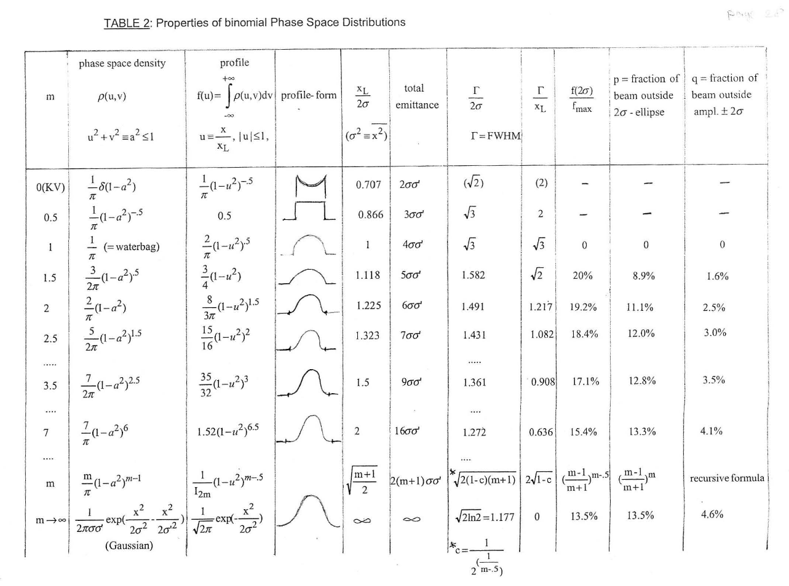

The `DISTRIBUTION` command defines how particles are introduced into a
simulation. A distribution has a name, a type, and a set of attributes that
control its geometry, momentum spread, emission behavior, and optional
correlations.

```text
Name: DISTRIBUTION, TYPE = DISTRIBUTION_TYPE,
      ATTRIBUTE1 = ...,
      ATTRIBUTE2 = ...;
```

The supported distribution types depend on whether you are looking at the
legacy OPAL manual path or the current OPALX implementation.

| Type | Description |
|---|---|
| `FROMFILE` | Read initial particle coordinates from a user-provided text file. |
| `GAUSS` | Gaussian distribution in one or more dimensions. |
| `FLATTOP` | Hard-edge transverse distribution with flat-top time structure. |
| `BINOMIAL` | Binomial family controlled by one shape parameter per axis. |
| `GAUSSMATCHED` | Matched Gaussian distribution for cyclotron-style matching. |
| `MULTIGAUSS` | Train of Gaussian pulses along the longitudinal direction. |
| `GUNGAUSSFLATTOPTH` | Legacy shorthand for emitted `FLATTOP` with `ASTRA`. |
| `ASTRAFLATTOPTH` | Legacy emitted flat-top photoinjector distribution. |

## Units {#opal-distribution-units}

Lengths are given in meters and times in seconds. Momentum input units depend on
`INPUTMOUNITS`.

| Attribute | Value | Meaning |
|---|---|---|
| `INPUTMOUNITS` | `NONE` | Use normalized momentum components `beta_x gamma`, `beta_y gamma`, `beta_z gamma`. This is the OPAL-T default. |
| `INPUTMOUNITS` | `EVOVERC` | Use momenta in `eV/c`. This is the OPAL-cycl default. |

### Momentum unit conversion {#opal-distribution-momentum-unit-conversion}

To convert from normalized momentum to transverse angle in mrad, use
$$
(\beta\gamma)_{\mathrm{ref}} = \frac{P}{m_0 c} = \frac{Pc}{m_0 c^2},
$$
and
$$
P_x[\mathrm{mrad}] = 1000 \times \frac{\beta_x\gamma}{(\beta\gamma)_{\mathrm{ref}}}.
$$

To convert from `eV/c` to dimensionless normalized momentum,
$$
\beta_x \gamma = \frac{P_x[\mathrm{eV}/c]}{m_0 c}
= \frac{P_x[\mathrm{eV}/c]\,c}{m_0 c^2}.
$$

The same relations apply to the `y` and `z` components.

## General Distribution Attributes {#opal-distribution-general-distribution-attributes}

The first major distinction is whether the distribution is injected at the
start of the simulation or emitted over time.

| Attribute | Value | Meaning |
|---|---|---|
| `EMITTED` | `FALSE` | Inject the full distribution at the start of the simulation. This is the default. |
| `EMITTED` | `TRUE` | Emit the particles over time. This is currently an OPAL-T mode. |

For injected distributions, the longitudinal coordinate is `z` in meters. For
emitted distributions, the longitudinal coordinate is `t` in seconds.

### Universal Attributes {#opal-distribution-universal-attributes}

These attributes apply to all distribution types:

| Attribute | Default | Meaning |
|---|---:|---|
| `WRITETOFILE` | `FALSE` | Write the generated initial distribution to a text file. |
| `SCALABLE` | `FALSE` | Make generation scalable with the number of MPI ranks. |
| `WEIGHT` | `1.0` | Relative weight when used in a distribution list. |
| `NBIN` | `0` | Number of energy bins. |
| `SBIN` | `100` | Sample bins per energy bin. |
| `XMULT`, `YMULT` | `1.0` | Scale transverse positions after generation. |
| `PXMULT`, `PYMULT`, `PZMULT` | `1.0` | Scale momentum components after generation. |
| `OFFSETX`, `OFFSETY` | `0.0` | Shift average transverse position. |
| `OFFSETPX`, `OFFSETPY`, `OFFSETPZ` | `0.0` | Shift average momentum. |
| `ID1`, `ID2` | zero 6-vector | Tracer particles written to `track_orbit.dat` in OPAL-cycl. |

### Injected Distribution Attributes {#opal-distribution-injected-distribution-attributes}

| Attribute | Default | Meaning |
|---|---:|---|
| `ZMULT` | `1.0` | Scale longitudinal position after generation. |
| `OFFSETZ` | `0.0` | Shift average longitudinal position. |

### Emitted Distribution Attributes {#opal-distribution-emitted-distribution-attributes}

| Attribute | Default | Meaning |
|---|---:|---|
| `TMULT` | `1.0` | Scale emission time after generation. |
| `OFFSETT` | `0.0` | Delay emission relative to the reference particle. |
| `EMISSIONSTEPS` | `1` | Number of timesteps used during emission. |
| `EMISSIONMODEL` | `NONE` | Emission model applied at the cathode. |

## Distribution Types {#opal-distribution-distribution-types}

### `FROMFILE` {#opal-distribution-fromfile}

`FROMFILE` reads coordinates from an external text file.

```text
Name: DISTRIBUTION, TYPE=FROMFILE,
      FNAME="text file name";
```

The type-specific attribute is:

| Attribute | Meaning |
|---|---|
| `FNAME` | File name containing the particle coordinates. |

For an injected `FROMFILE` distribution, the file format is:

```text
N
x1 px1 y1 py1 z1 pz1
x2 px2 y2 py2 z2 pz2
...
xN pxN yN pyN zN pzN
```

For an emitted `FROMFILE` distribution, `z` is replaced by `t`:

```text
N
x1 px1 y1 py1 t1 pz1
x2 px2 y2 py2 t2 pz2
...
xN pxN yN pyN tN pzN
```

The emitted case is internally shifted so that emission starts from negative
time and particles appear as the simulation clock advances.

When using `FROMFILE`, the particle count must match the `BEAM` `NPART`
expectation, and the mean momentum in the file must be consistent with the beam
energy settings.

### `GAUSS` {#opal-distribution-gauss}

`GAUSS` creates a six-dimensional Gaussian bunch. The core attributes are:

| Attribute | Meaning |
|---|---|
| `SIGMAX`, `SIGMAY` | RMS transverse widths. |
| `SIGMAR` | RMS radial width; overrides `SIGMAX` and `SIGMAY` if nonzero. |
| `SIGMAZ`, `SIGMAT` | RMS bunch length in `z` or `t`. `SIGMAZ` overrides `SIGMAT`. |
| `SIGMAPX`, `SIGMAPY`, `SIGMAPZ` | RMS momentum spreads. |
| `CUTOFFX`, `CUTOFFY`, `CUTOFFR`, `CUTOFFLONG`, `CUTOFFPX`, `CUTOFFPY`, `CUTOFFPZ` | Cutoffs expressed in units of the corresponding sigma. |

Example:

```text
Name: DISTRIBUTION, TYPE       = GAUSS,
      SIGMAX     = 0.001,
      SIGMAY     = 0.003,
      SIGMAZ     = 0.002,
      SIGMAPX    = 0.0,
      SIGMAPY    = 0.0,
      SIGMAPZ    = 0.0,
      CUTOFFX    = 2.0,
      CUTOFFY    = 2.0,
      CUTOFFLONG = 4.0,
      OFFSETX    = 0.001,
      OFFSETY    = -0.002,
      OFFSETZ    = 0.01,
      OFFSETPZ   = 1200.0;
```

#### `GAUSS` for photoinjectors {#opal-distribution-gauss-for-photoinjectors}

For emitted beams, `GAUSS` can also produce a half-Gaussian rise, flat-top,
half-Gaussian fall time profile. The key extra attributes are:

| Attribute | Meaning |
|---|---|
| `TPULSEFWHM` | Full-width-at-half-maximum pulse length. |
| `TRISE` | Rise time. Overrides `SIGMAT`. |
| `TFALL` | Fall time. Overrides `SIGMAT`. |
| `FTOSCAMPLITUDE` | Oscillation amplitude on the flat top, in percent. |
| `FTOSCPERIODS` | Number of oscillation periods across the flat top. |

{#fig-distribution-flattop width="60%"}

The rise and fall parameters correspond to
$$
\mathrm{TRISE} = 1.6869\,\sigma_R,
\qquad
\mathrm{TFALL} = 1.6869\,\sigma_F,
$$
and the pulse FWHM is
$$
\mathrm{TPULSEFWHM} = t_{\mathrm{flattop}} + \sqrt{2\ln 2}(\sigma_R + \sigma_F).
$$

The total emission time depends on `CUTOFFLONG`:
$$
t_E = \mathrm{TPULSEFWHM}
     + \frac{\mathrm{CUTOFFLONG} - \sqrt{2 \ln 2}}{1.6869}
       (\mathrm{TRISE} + \mathrm{TFALL}).
$$

#### Correlations for `GAUSS` {#opal-distribution-correlations-for-gauss}

The Gaussian generator also supports experimental correlations. They can be
given either as a compact array `R` or through named coefficients such as:

- `CORRX`, `CORRY`, `CORRZ`
- `R51`, `R52`
- `R61`, `R62`

In the four-dimensional `(x, p_x, z, p_z)` subspace, the correlation matrix is
$$
\sigma =
\begin{bmatrix}
1 & c_x & R_{51} & R_{61} \\
c_x & 1 & R_{52} & R_{62} \\
R_{51} & R_{52} & 1 & c_t \\
R_{61} & R_{62} & c_t & 1
\end{bmatrix}.
$$

The implementation constructs correlated samples from the Cholesky
factorization of this matrix. This feature is experimental and only documented
for Gaussian distributions.

### `FLATTOP` {#opal-distribution-flattop}

`FLATTOP` defines hard-edge distributions and is commonly used to model laser
profiles in photoinjectors.

#### Injected `FLATTOP` {#opal-distribution-injected-flattop}

For injected beams, the distribution is a uniformly filled ellipse
transversely and uniform in `z`.

| Attribute | Meaning |
|---|---|
| `SIGMAX`, `SIGMAY` | Hard-edge widths. |
| `SIGMAR` | Radial hard-edge width; overrides `SIGMAX` and `SIGMAY`. |
| `SIGMAZ` | Hard-edge bunch length. |

#### Emitted `FLATTOP` {#opal-distribution-emitted-flattop}

For emitted beams, `FLATTOP` uses the same longitudinal pulse-shape parameters
as the photoinjector-style `GAUSS` case.

Additional attributes include:

| Attribute | Meaning |
|---|---|
| `SIGMAX`, `SIGMAY`, `SIGMAR` | Hard-edge transverse beam size. |
| `SIGMAT`, `TPULSEFWHM`, `TRISE`, `TFALL` | Time-profile parameters. |
| `FTOSCAMPLITUDE`, `FTOSCPERIODS` | Oscillations on the flat top. |
| `LASERPROFFN`, `IMAGENAME`, `INTENSITYCUT` | Laser-profile image input. |
| `FLIPX`, `FLIPY`, `ROTATE90`, `ROTATE180`, `ROTATE270` | Laser-image transforms. |

Example:

```text
Dist: DISTRIBUTION, TYPE = FLATTOP,
      SIGMAX = 0.001,
      SIGMAY = 0.002,
      TRISE = 0.5e-12,
      TFALL = 0.5e-12,
      TPULSEFWHM = 10.0e-12,
      CUTOFFLONG = 4.0,
      NBIN = 5,
      EMISSIONSTEPS = 100,
      EMISSIONMODEL = ASTRA,
      EKIN = 0.5,
      EMITTED = TRUE;
```

The legacy manual also describes a laser-image driven transverse sampling path
through `LASERPROFFN`, but explicitly marks it as under development.

#### `GUNGAUSSFLATTOPTH` and `ASTRAFLATTOPTH` {#opal-distribution-gungaussflattopth-and-astraflattopth}

These are legacy shorthands for emitted flat-top photoinjector distributions.
Both correspond to `FLATTOP`-style emission. `GUNGAUSSFLATTOPTH` automatically
enables `EMITTED=TRUE` and `EMISSIONMODEL=ASTRA`, while
`ASTRAFLATTOPTH` follows the same idea with a slightly different legacy
longitudinal profile generator.

### `BINOMIAL` {#opal-distribution-binomial}

`BINOMIAL` generates a family of distributions governed by one parameter `m`
per axis. Changing `m` moves continuously from hollow-shell and flat-profile
shapes toward Gaussian-like limits [@JohoDist].

{#fig-distribution-binomial width="80%"}

The key shape parameters are:

| Attribute | Meaning |
|---|---|
| `MX` | Binomial parameter in `x`. |
| `MY` | Binomial parameter in `y`. |
| `MT`, `MZ` | Binomial parameter in the longitudinal direction. `MZ` is the same as `MT`. |

The phase-space widths are still set through the usual `SIGMAX`, `SIGMAPX`,
`CORRX`, and corresponding `y` and `z/t` variants.

For one plane,
$$
\epsilon_x = \sigma_x \sigma_{x'} \cos\!\left(\arcsin(\sigma_{12})\right),
$$
with the corresponding Twiss relations
$$
\beta_x = \frac{\sigma_x^2}{\epsilon_x},
\qquad
\gamma_x = \frac{\sigma_{x'}^2}{\epsilon_x},
\qquad
\alpha_x = -\sigma_{12}\sqrt{\beta_x \gamma_x}.
$$

Example:

```text
Dist: DISTRIBUTION, TYPE    = BINOMIAL,
      SIGMAX  = 2.15e-03,
      SIGMAPX = 1E-6,
      CORRX   = 0.0,
      MX      = 0.01,
      SIGMAY  = 0.50*23.e-03,
      SIGMAPY = 28.0,
      CORRY   = 0.5,
      MY      = 990.0,
      SIGMAT  = 1.0e-1,
      SIGMAPT = 11.96,
      CORRT   = -0.5,
      MT      = 2.0;
```

### `GAUSSMATCHED` {#opal-distribution-gaussmatched}

`GAUSSMATCHED` constructs a matched Gaussian distribution, intended for
cyclotron-style matched injection. The main control parameters are:

| Attribute | Meaning |
|---|---|
| `DENERGY` | Energy step size for the closed-orbit finder. |
| `EX`, `EY`, `ET` | Projected normalized emittances. |
| `NSTEPS`, `NSECTORS` | Closed-orbit integration controls. |
| `SECTOR` | Match using one sector or the full ring. |
| `ORDERMAPS` | Order used in the field expansion. |
| `RGUESS` | Initial radius guess. |
| `RESIDUUM` | Convergence target. |
| `MAXSTEPSCO`, `MAXSTEPSSI` | Iteration limits for the closed-orbit and matching loops. |

The legacy manual explicitly notes one limitation: trim-coil field maps are not
included in this matched-distribution construction.

### `MULTIGAUSS` {#opal-distribution-multigauss}

`MULTIGAUSS` models a train of Gaussian pulses. Transversely it uses a uniform
elliptical profile, while longitudinally it generates `NPEAKS` equally spaced
Gaussian peaks [@laserPulseShaping].

Key attributes are:

| Attribute | Meaning |
|---|---|
| `SIGMAX`, `SIGMAY`, `SIGMAR` | Transverse size. |
| `SIGMAZ`, `SIGMAT` | RMS length of each Gaussian pulse. |
| `SEPPEAKS` | Peak-to-peak separation. |
| `NPEAKS` | Number of Gaussian pulses. |
| `CUTOFFLONG` | Longitudinal cutoff relative to the first and last pulse. |
| `SIGMAPX`, `SIGMAPY`, `SIGMAPZ` | Momentum spread for injected beams. |
| `CUTOFFPX`, `CUTOFFPY`, `CUTOFFPZ` | Momentum cutoffs for injected beams. |

When emitted, the momentum is assigned by the selected emission model. When
injected, the momentum components are sampled from normal distributions.

{#fig-distribution-multigauss width="55%"}

Example:

```text
Dist: DISTRIBUTION, TYPE = MULTIGAUSS,
      SIGMAPX = 1e-2, SIGMAPY = 1e-2, SIGMAPZ = 1e-2,
      CUTOFFPX = 4.0, CUTOFFPY = 4.0, CUTOFFPZ = 4.0,
      SIGMAR = 340e-6,
      SIGMAZ = 90e-6 / 2.355,
      CUTOFFLONG = 4.0,
      SEPPEAKS = 126e-6,
      NPEAKS = 4,
      EMITTED = FALSE;
```

## Emission Models {#opal-distribution-emission-models}

Emission models apply only to emitted distributions and determine how thermal
energy and cathode physics are translated into initial particle momentum.

### `NONE` {#opal-distribution-none}

`NONE` is the default OPAL-T emission model. It adds a user-specified kinetic
energy `EKIN` to the longitudinal momentum only.

| Attribute | Default | Meaning |
|---|---:|---|
| `EKIN` | `1.0 eV` | Thermal energy added during emission. |

This model is useful for transversely cold emitted beams. If `EKIN=0`, emitted
particles may fail to drift off the cathode cleanly.

### `ASTRA` {#opal-distribution-astra}

`ASTRA` uses the same `EKIN` parameter but distributes the momentum
three-dimensionally:
$$
p_{\mathrm{total}} = \sqrt{\left(\frac{\mathrm{EKIN}}{mc^2}+1\right)^2 - 1},
$$
$$
p_x = p_{\mathrm{total}}\sin(\theta)\cos(\phi),\quad
p_y = p_{\mathrm{total}}\sin(\theta)\sin(\phi),\quad
p_z = p_{\mathrm{total}}|\cos(\theta)|.
$$

Here `theta` is random on `[0, pi]`, and
$$
\phi = 2 \arccos\!\left(\sqrt{x}\right),
$$
with `x` a uniform random number on `[0, 1]`.

### `NONEQUIL` {#opal-distribution-nonequil}

`NONEQUIL` is a more physical photoemission model for metal cathodes and
materials such as `CsTe` [@flo97; @clen2000; @dowe2009].

Its additional parameters are:

| Attribute | Default | Meaning |
|---|---:|---|
| `ELASER` | `4.86 eV` | Drive-laser photon energy. |
| `W` | `4.31 eV` | Cathode work function. |
| `FE` | `7.0 eV` | Fermi energy. |
| `CATHTEMP` | `300 K` | Cathode temperature. |

Example:

```text
Dist: DISTRIBUTION, TYPE = GAUSS,
      SIGMAX = 0.001,
      SIGMAY = 0.002,
      TRISE = 1.0e-12,
      TFALL = 1.0e-12,
      TPULSEFWHM = 15.0e-12,
      CUTOFFLONG = 3.0,
      NBIN = 10,
      EMISSIONSTEPS = 100,
      EMISSIONMODEL = NONEQUIL,
      ELASER = 6.48,
      W = 4.1,
      FE = 7.0,
      CATHTEMP = 325,
      EMITTED = TRUE;
```

## Distribution List {#opal-distribution-distribution-list}

The `RUN` command can accept either a single distribution or a list:

```text
RUN, METHOD = "PARALLEL-T",
     BEAM = beam_name,
     FIELDSOLVER = field_solver_name,
     DISTRIBUTION = DIST1;
```

or

```text
RUN, METHOD = "PARALLEL-T",
     BEAM = beam_name,
     FIELDSOLVER = field_solver_name,
     DISTRIBUTION = {DIST1, DIST2, DIST3};
```

In a distribution list:

- the first entry is the master distribution
- all other distributions inherit its `EMITTED` or injected mode
- the total number of particles is still controlled by the `BEAM` command
- per-distribution particle counts are apportioned through `WEIGHT`

`FROMFILE` is the special case: its particle count comes from the file rather
than from `BEAM` and `WEIGHT`.
