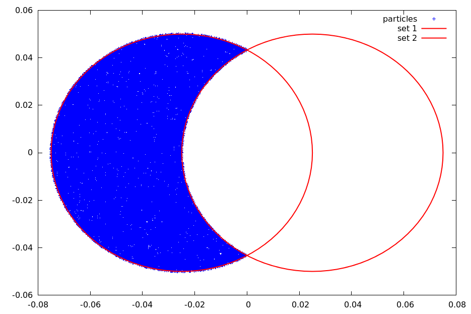
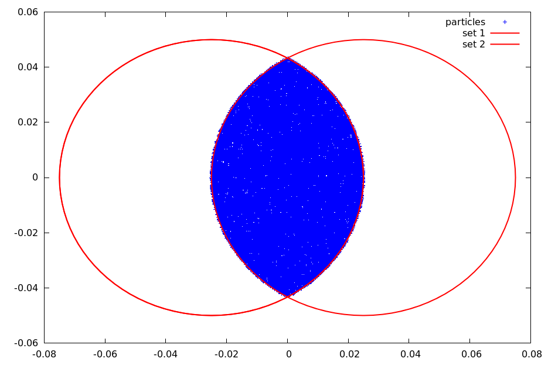
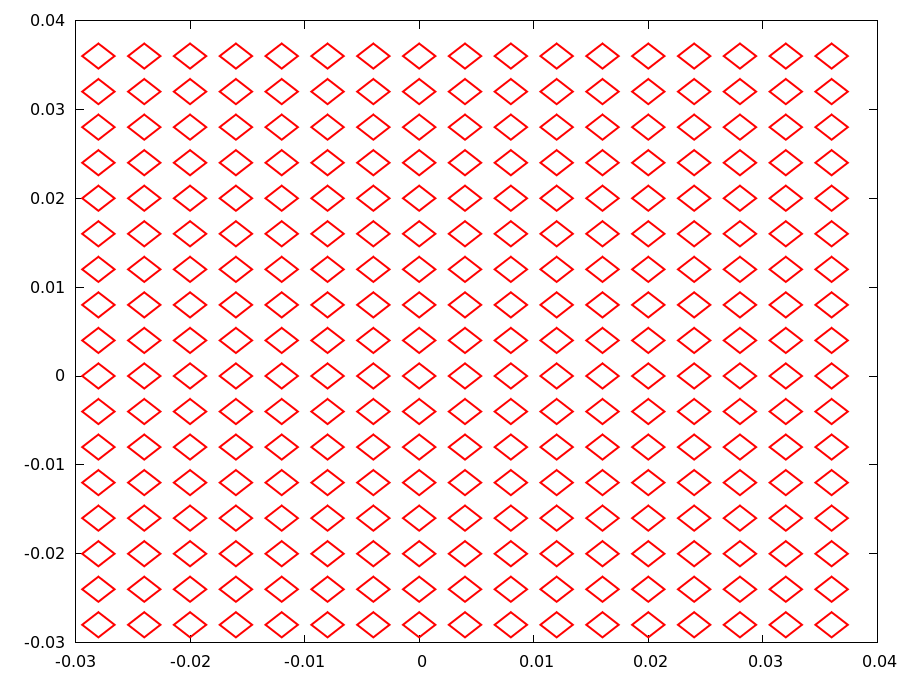
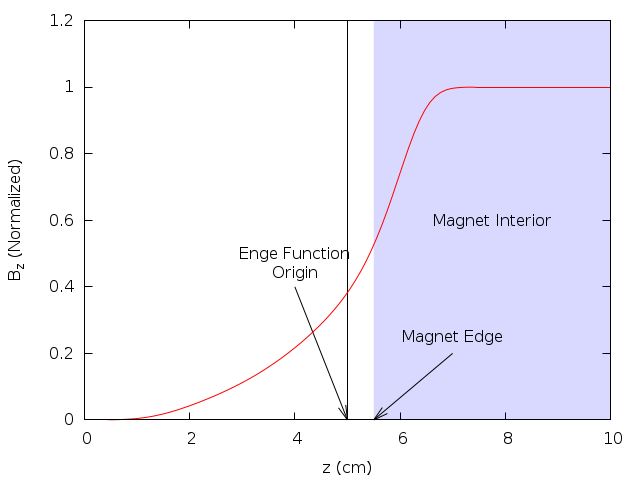

This chapter is the first mixed migration chapter in the Quarto pilot. It
combines:

- legacy OPAL element semantics ported from the Asciidoctor manual
- OPALX-native analytic element descriptions already written directly in Quarto

## Element Input Format {#opal-element-input-format}

All physical elements are defined by statements of the form

```text
label:keyword, attribute,..., attribute
```

where:

`label`
: is the name given to the element, for example `QF`. It is an identifier.

`keyword`
: is an element-type keyword, for example `QUADRUPOLE`.

`attribute`
: usually has the form

```text
attribute-name=attribute-value
```

Omitted attributes are assigned a default value, normally zero.

Example:

```text
QF: QUADRUPOLE, L=1.8, K1=0.015832;
```

## Common Attributes for All Elements {#opal-common-attributes-for-all-elements}

The following attributes are shared by all elements.

| Attribute | Meaning |
|---|---|
| `TYPE` | Engineering type string used for element selection. |
| `APERTURE` | Aperture specification such as `SQUARE(a,f)`, `RECTANGLE(a,b,f)`, `CIRCLE(d,f)`, or `ELLIPSE(a,b,f)`. |
| `L` | Physical element length. |
| `ELEMEDGE` | Position of the physical start of the element in `s`. |
| `X`, `Y`, `Z` | Absolute position components when absolute placement is used. |
| `THETA`, `PHI`, `PSI` | Orientation angles relative to the first beamline using absolute positioning. |
| `DX`, `DY`, `DZ` | Position errors that do not affect the design trajectory. |
| `DTHETA`, `DPHI`, `DPSI` | Rotation errors that do not affect the design trajectory. |
| `WAKEF` | Attach a wakefield defined by the `WAKE` command. |
| `PARTICLEMATTERINTERACTION` | Attach a particle-matter interaction handler. |
| `OUTFN` | Base file name for element-generated output. |
| `DELETEONTRANSVERSEEXIT` | Control whether particles exiting on the transverse sides are deleted in OPAL-T. |

Dipoles are a special case because `GAP` and `HGAP` define their aperture
instead of the generic `APERTURE` attribute.

Default aperture for all other elements is a circle of `1E6 m`.

## Drift Spaces {#opal-drift-spaces}

```text
label: DRIFT, TYPE=string, APERTURE=string, L=real;
```

A `DRIFT` space has no additional attributes.

Examples:

```text
DR1: DRIFT, L=1.5;
DR2: DRIFT, L=DR1->L, TYPE=DRF;
```

The length of `DR2` will always be equal to the length of `DR1`. The reference
system for a drift space is a Cartesian coordinate system.

## Quadrupole {#opal-quadrupole}

```text
label: QUADRUPOLE, TYPE=string, APERTURE=real-vector,
      L=real, K1=real, K1S=real;
```

A `QUADRUPOLE` is a straight Cartesian magnet with normal and skew
quadrupole components.

`K1`
: normal quadrupole gradient
  $K_1 = \partial B_y / \partial x$ in $\mathrm{Tm^{-1}}$.
  Positive `K1` means horizontal focusing for positively charged particles
  moving in the positive design direction.

`K1S`
: skew quadrupole component
  $K_{1s} = - \partial B_x / \partial x$ in $\mathrm{Tm^{-1}}$.

`DK1`, `DK1S`
: normalized strength errors for the normal and skew component.

Example:

```text
QP1: QUADRUPOLE, L=1.20, ELEMEDGE=-0.5265, K1=0.11;
```

## Sextupole {#opal-sextupole}

```text
label: SEXTUPOLE, TYPE=string, APERTURE=real-vector,
       L=real, K2=real, K2S=real;
```

A `SEXTUPOLE` is a straight Cartesian element with second-order normal and skew
components.

`K2`
: normal sextupole strength
  $K_2 = \partial^2 B_y / \partial x^2$ in $\mathrm{Tm^{-2}}$.

`K2S`
: skew sextupole strength
  $K_{2s} = - \partial^2 B_x / \partial x^2$ in $\mathrm{Tm^{-2}}$.

`DK2`, `DK2S`
: normalized strength errors.

Example:

```text
S1: SEXTUPOLE, L=0.4, K2=0.00134;
```

## Octupole {#opal-octupole}

```text
label: OCTUPOLE, TYPE=string, APERTURE=real-vector,
      L=real, K3=real, K3S=real;
```

`K3`
: normal octupole strength
  $K_3 = \partial^3 B_y / \partial x^3$ in $\mathrm{Tm^{-3}}$.

`K3S`
: skew octupole strength
  $K_{3s} = - \partial^3 B_x / \partial x^3$ in $\mathrm{Tm^{-3}}$.

`DK3`, `DK3S`
: normalized strength errors.

Example:

```text
O3: OCTUPOLE, L=0.3, K3=0.543;
```

## General Multipole {#opal-general-multipole}

The legacy `MULTIPOLE` element defines a thick straight multipole of arbitrary
order.

```text
label: MULTIPOLE, TYPE=string, APERTURE=real-vector,
      L=real, KN=real-vector, KS=real-vector;
```

`KN`
: array of normal coefficients
  $K_n = \partial^n B_y / \partial x^n$.

`KS`
: array of skew coefficients
  $K_{ns} = - \partial^n B_x / \partial x^n$.

`DKN`, `DKS`
: normalized strength-error arrays for the normal and skew coefficients.

If `L != 0`, the strengths are interpreted per unit length. If `L == 0`, they
are integrated strengths. The multipole order of coefficient `n` corresponds to
`2n+2` poles. Superposition of several orders is allowed.

Example:

```text
M27: MULTIPOLE, L=1.0, ELEMEDGE=3.8, KN={0.0, 0.11};
```


## General Multipole With Fringe Field Model {#opal-general-multipole-with-fringe-field-model}

`MULTIPOLET` is the extended cyclotron-side multipole element with explicit
fringe fields. It can represent either a straight magnet or a curved magnet
with a prescribed bend angle.

```text
label: MULTIPOLET, L=real, TP=real-vector,
       LFRINGE=real, RFRINGE=real,
       VAPERT=real, HAPERT=real,
       MAXFORDER=real, ROTATION=real,
       EANGLE=real, BBLENGTH=real, ANGLE=real,
       MAXXORDER=real, VARRADIUS=bool,
       ENTRYOFFSET=real, SCALING_MODEL=string;
```

The most important attributes are:

`TP`
: transverse mid-plane polynomial coefficients
  $T(x) = B_0 + B_1 x + B_2 x^2 + \dots$.

`LFRINGE`, `RFRINGE`
: left and right fringe-field lengths.

`ANGLE`
: physical bend angle of the magnet.

`VARRADIUS`
: when `TRUE`, the bend radius can vary so that the reference path remains in
  the magnet center. This is a cyclotron-side restricted feature.

`ROTATION`
: roll of a straight magnet about its central axis to obtain skew fields.

`SCALING_MODEL`
: optional time-dependent scaling model for the multipole coefficients.

This element uses a fringe-field model based on a scalar-potential expansion
with a mid-plane profile multiplied by a longitudinal fringe function.

Example:

```text
M30: MULTIPOLET, L=1, RFRINGE=0.3, LFRINGE=0.2,
     ANGLE=PI/6, TP={2.0, 0.1}, VARRADIUS=TRUE, BBLENGTH=2;
```


## Solenoid {#opal-solenoid}

```text
label: SOLENOID, TYPE=string, APERTURE=real-vector,
      L=real, KS=real;
```

A `SOLENOID` has one principal strength attribute:

`KS`
: the solenoid strength
  $K_s = \frac{\partial B_s}{\partial s}$, in $\mathrm{Tm^{-1}}$.
  For positive `KS` and positive particle charge, the solenoid field points in
  the direction of increasing `s`.

The reference system for a solenoid is a Cartesian coordinate system.

In OPAL-T mode, field maps are specified through:

`FMAPFN`
: file name of the field map.

Example:

```text
SP1: SOLENOID, L=1.20, ELEMEDGE=-0.5265, KS=0.11,
     FMAPFN="1T1.T7";
```

## RF Cavities {#opal-rf-cavities}

An `RFCAVITY` is the legacy standing-wave cavity element used in both beamline
and cyclotron workflows. The common syntax is:

```text
label: RFCAVITY, APERTURE=real-vector, L=real,
       VOLT=real, LAG=real;
```

`L`
: cavity length in `m`.

`VOLT`
: peak RF voltage in `MV`. The cavity kick is parameterized as
  $\delta E = \mathrm{VOLT}\cdot\sin(2\pi(\mathrm{LAG}-\mathrm{HARMON}\cdot f_0 t))$.

`LAG`
: phase lag in `rad`. In OPAL-T this is generally measured relative to the
  phase that maximizes the reference-particle energy gain. That phase is found
  by the auto-phasing algorithm unless the cavity is vetoed.

`DLAG`
: phase-lag error in `rad`.

### OPAL-T mode {#opal-opal-t-mode}

Additional OPAL-T attributes are:

`FMAPFN`
: field-map file in `T7` format.

`TYPE`
: cavity type, either `STANDING` (default) or `SINGLEGAP`.

`FREQ`
: cavity frequency in `MHz`. If both the cavity card and the field map define a
  frequency, OPAL-T warns on mismatch and uses the card value.

`APVETO`
: if `TRUE`, the cavity is excluded from auto-phasing and the phase equals
  `LAG` at the arrival time of the reference particle at the field boundary.

Example standing-wave cavity that mimics a DC gun:

```text
gun: RFCAVITY, L=0.018, VOLT=-131/(1.052*2.658),
     FMAPFN="1T3.T7", ELEMEDGE=0.00,
     TYPE=STANDING, FREQ=1.0e-6;
```

Example two-frequency standing-wave system:

```text
rf1: RFCAVITY, L=0.54, VOLT=19.961, LAG=193.0/360.0,
     FMAPFN="1T3.T7", ELEMEDGE=0.129, TYPE=STANDING,
     FREQ=1498.956;

rf2: RFCAVITY, L=0.54, VOLT=6.250, LAG=136.0/360.0,
     FMAPFN="1T4.T7", ELEMEDGE=0.129, TYPE=STANDING,
     FREQ=4497.536;
```

## Traveling Wave Structure {#opal-traveling-wave-structure}

A `TRAVELINGWAVE` structure is an OPAL-T element reconstructed from a
one-dimensional standing-wave field map and a repeated-cell model.

{#fig-finsb-rac-field width="60%"}

An example of a 1D traveling-wave field map is shown in @fig-finsb-rac-field.
The map itself is a standing-wave solution for a single accelerating cavity.
OPAL-T reconstructs the full traveling-wave tank in three parts:

1. entrance fringe field,
2. repeated accelerating-cell region,
3. exit fringe field.

### Fringe fields {#opal-fringe-fields}

The entrance and exit fringe fields are treated as standing-wave regions:
$$
\begin{aligned}
\mathbf{E}_{\mathrm{entrance}}(\mathbf{r},t) &= \mathbf{E}_{\mathrm{from\,map}}(\mathbf{r})\,\mathrm{VOLT}\,
\cos\!\bigl(2\pi\,\mathrm{FREQ}\,t + \phi_{\mathrm{entrance}}\bigr), \\\\
\mathbf{E}_{\mathrm{exit}}(\mathbf{r},t) &= \mathbf{E}_{\mathrm{from\,map}}(\mathbf{r})\,\mathrm{VOLT}\,
\cos\!\bigl(2\pi\,\mathrm{FREQ}\,t + \phi_{\mathrm{exit}}\bigr).
\end{aligned}
$$
Here `VOLT` and `FREQ` are the element amplitude and frequency, the entrance
phase is `\phi_{entrance} = \mathrm{LAG}`, and the exit phase is determined
internally from `LAG` and `NUMCELLS`.

### Reconstructed body field {#opal-reconstructed-body-field}

The field of the accelerating structure body is reconstructed from the central
part of the standing-wave map by superposition:
$$
\begin{aligned}
\mathbf{E}(\mathbf{r},t) = \frac{\mathrm{VOLT}}{\sin(2\pi\,\mathrm{MODE})}
\Bigl[
&\mathbf{E}_{\mathrm{from\,map}}(x,y,z)
\cos\!\bigl(2\pi\,\mathrm{FREQ}\,t + \mathrm{LAG} + \tfrac{\pi}{2}\,\mathrm{MODE}\bigr) \\\\
+&\mathbf{E}_{\mathrm{from\,map}}(x,y,z+d)
\cos\!\bigl(2\pi\,\mathrm{FREQ}\,t + \mathrm{LAG} + \tfrac{3\pi}{2}\,\mathrm{MODE}\bigr)
\Bigr].
\end{aligned}
$$
The cell spacing is
$$
d = \lambda\,\mathrm{MODE},
$$
where `MODE` is expressed in units of `2π`. When the longitudinal coordinate
advances past the end of the available map interval, OPAL-T subtracts an
integer number of cavity wavelengths until the position falls back inside the
repeated-cell range.

The legacy model therefore treats the entry and exit half cells through the
standing-wave fringe fields and the interior through a repeated-cell traveling
wave assembled from the same on-axis map.

The element attributes are:

```text
label: TRAVELINGWAVE, APERTURE=real-vector, L=real,
       VOLT=real, LAG=real, FMAPFN=string,
       ELEMEDGE=real, FREQ=real, NUMCELLS=integer,
       MODE=real;
```

`L`
: cavity length. In OPAL-T the effective structure length is reconstructed from
  the field map and `NUMCELLS`, so `L` is not the primary geometric input.

`VOLT`
: peak RF voltage. The accelerating phase is again expressed by `LAG`.

`LAG`
: phase lag in `rad`. In OPAL-T this is normally defined relative to the phase
  that maximizes energy gain of the reference particle, as determined by the
  auto-phasing algorithm.

`DLAG`
: phase-lag error in `rad`.

`FMAPFN`
: field map in `T7` format.

`FREQ`
: traveling-wave frequency in `MHz`. As for `RFCAVITY`, OPAL-T warns when this
  differs from the frequency declared in the field map, and the map value takes
  precedence.

`NUMCELLS`
: number of accelerating cells, excluding entry and exit half-cell fringes.

`MODE`
: mode in units of `2π`; for example `1/3` stands for a `2π/3` structure.

`FAST`
: if `TRUE` and the field map is 1D, OPAL-T builds a 2D interpolation map and
  avoids an FFT-based evaluation on every particle and every step.

`APVETO`
: disable auto-phasing for this structure and use the user-supplied `LAG`
  directly at the arrival time of the reference particle at the field boundary.

The traveling-wave model requires the particle momentum `P` and charge `CHARGE`
to be defined on the relevant optics command before the structure is used.

Example:

```text
lrf0: TRAVELINGWAVE, L=0.0253, VOLT=14.750,
      NUMCELLS=40, ELEMEDGE=2.73066,
      FMAPFN="INLB-02-RAC.Ez", MODE=1/3,
      FREQ=1498.956, LAG=248.0/360.0;
```
## Monitor {#opal-monitor}

A `MONITOR` detects all particles passing it and writes the position, momentum,
and time of impact into an H5hut file. It always has an effective length of
1 cm, consisting of a 0.5 cm drift, the monitor of zero length, and another
0.5 cm drift. This prevents OPAL-T from missing particles.

The positions of the particles on the monitor are interpolated from the current
position and momentum one step before they would pass the monitor.

`OUTFN`
: file name into which the monitor writes the collected data.

If `TYPE=TEMPORAL`, the data of all particles are written when the reference
particle hits the monitor.

## Collimators {#opal-collimators}

Four collimator families exist in the legacy manual:

- `ECOLLIMATOR`: elliptic aperture
- `RCOLLIMATOR`: rectangular aperture
- `FLEXIBLECOLLIMATOR`: arbitrary aperture description
- `CCOLLIMATOR`: cyclotron-specific radial rectangular collimator

The common OPAL-T beamline syntax is:

```text
label: ECOLLIMATOR, TYPE=string, APERTURE=real-vector,
       L=real, XSIZE=real, YSIZE=real;

label: RCOLLIMATOR, TYPE=string, APERTURE=real-vector,
       L=real, XSIZE=real, YSIZE=real;

label: FLEXIBLECOLLIMATOR, APERTURE=real-vector,
       L=real, DESCRIPTION=string, FNAME=string, OUTFN=string;
```

Common attributes:

`OUTFN`
: file name for lost-particle output. If omitted, the element label is used.
  The output is written as H5hut, or ASCII when `ASCIIDUMP` is enabled.

`PARTICLEMATTERINTERACTION`
: activates scattering and energy-loss modeling when configured.

### OPAL-T mode {#opal-opal-t-mode-2}

Optically, a collimator behaves like a drift space, but during tracking it also
introduces an aperture limit. The aperture is checked at the entrance, and if
the collimator has nonzero length it is also checked at the exit and at every
timestep.

`XSIZE`
: horizontal half-aperture in `m`.

`YSIZE`
: vertical half-aperture in `m`.

For `ECOLLIMATOR`, the values are ellipse half-axes; for `RCOLLIMATOR`, they
are rectangle half-widths.

Example:

```text
Col: ECOLLIMATOR, L=1.0E-3, ELEMEDGE=3.0E-3, XSIZE=5.0E-4,
     YSIZE=5.0E-4, OUTFN="Coll.h5";
```

`FLEXIBLECOLLIMATOR` extends this with a small shape-description language.
The supported primitive and composition commands are:

`rectangle(width, height)`
: rectangle centered at the origin.

`ellipse(width, height)`
: ellipse centered at the origin.

`polygon(x0, y0; x1, y1; ...; xN, yN)`
: polygon whose final point is implicitly connected back to the first point.
  The polygon is triangulated internally, so self-crossing edges are not
  allowed.

`mask('filename.pbm', width, height)`
: black-and-white `PBM` bitmap mask. White pixels stop particles.

`translate(command, shiftx, shifty)`
: translate a shape by `(shiftx, shifty)`.

`rotate(command, angle)`
: rotate a shape about the origin.

`union(command1, command2, ...)`
: union of several shape definitions.

`difference(command1, command2)`
: particles pass `command1` but not `command2`.

`symmetric_difference(command1, command2)`
: particles pass either command but not both at the same time.

`intersection(command1, command2)`
: particles pass both commands simultaneously.

`repeat(command, N, shiftx, shifty)`
: repeat a shape `N` times with a translational offset.

`repeat(command, N, angle)`
: repeat a shape `N` times with successive rotation.

{#fig-elements-difference width="60%"}

{#fig-elements-symmetric-difference width="60%"}

{#fig-elements-intersection width="60%"}

The expression language supports the following constants and functions:

| Constants and functions | Constants and functions | Constants and functions | Constants and functions |
|---|---|---|---|
| `e` | `pi` | `abs(x)` | `acos(x)` |
| `acosh(x)` | `asin(x)` | `asinh(x)` | `atan(x)` |
| `atanh(x)` | `cbrt(x)` | `ceil(x)` | `cos(x)` |
| `cosh(x)` | `deg2rad(x)` | `erf(x)` | `erfc(x)` |
| `exp(x)` | `exp2(x)` | `floor(x)` | `isinf(x)` |
| `isnan(x)` | `log(x)` | `log2(x)` | `log10(x)` |
| `rad2deg(x)` | `round(x)` | `sgn(x)` | `sin(x)` |
| `sinh(x)` | `sqrt(x)` | `tan(x)` | `tanh(x)` |
| `tgamma(x)` | `atan2(y,x)` | `max(x,y)` | `min(x,y)` |
| `pow(x,n)` |  |  |  |

A simple elliptic collimator can be described by:

```text
ellipse(0.04, 0.03)
```

A regular pepper-pot with rectangular holes can be described by:

```text
repeat(
       repeat(
              translate(
                        rotate(
                               rectangle(
                                         0.002,
                                         0.002
                                        ),
                               0.78539
                              ),
                        -0.028,
                        -0.028
                       ),
              16,
              0.004,
              0.0
             ),
       16,
       0.0,
       0.004
      )
```

{#fig-elements-pepperpot width="60%"}

In `FLEXIBLECOLLIMATOR`, the hole description can be supplied directly through
`DESCRIPTION` or through an external file specified by `FNAME`. The external
file form is the one that allows comments and line breaks.

## Correctors {#opal-correctors}

Three types of correctors are available:

- `HKICKER`: horizontal corrector
- `VKICKER`: vertical corrector
- `KICKER`: combined horizontal and vertical corrector

They are defined as:

```text
label: HKICKER, TYPE=string, APERTURE=real-vector,
      L=real, KICK=real;
label: VKICKER, TYPE=string, APERTURE=real-vector,
      L=real, KICK=real;
label: KICKER, TYPE=string, APERTURE=real-vector,
      L=real, HKICK=real, VKICK=real;
```

Attributes:

`KICK`
: kick angle in `rad` for `HKICKER` or `VKICKER`.

`HKICK`, `VKICK`
: horizontal and vertical kick angles for `KICKER`.

`DESIGNENERGY`
: if set, fixes the magnetic field magnitude using the given design energy in
  `MeV` and the requested kick angle.

A positive kick increases $p_x$ or $p_y$ respectively.

Examples:

```text
HK1: HKICKER, KICK=0.001;
VK3: VKICKER, KICK=0.0005;
KHV: KICKER,  HKICK=0.001, VKICK=0.0005;
```

Correctors do not change the reference trajectory. Otherwise they are
implemented like `RBEND` with `E1 = 0` and without fringe fields.

## Bending Magnets {#opal-bending-magnets}

Legacy OPAL supports four bend families:

- `RBEND` for rectangular bends in OPAL-T
- `RBEND3D` for rectangular bends with field-map support in OPAL-T
- `SBEND` for sector bends in OPAL-T

`RBEND` and `SBEND` share the same basic dipole semantics but differ in their
reference geometry. `RBEND` has parallel pole faces and an exit angle fixed by
`ANGLE - E1`; `SBEND` uses a sector reference arc and supports independent
entrance and exit edge angles.

{#fig-elements-rbend width="70%"}

### `RBEND` {#opal-rbend}

Key attributes are:

- `L`: physical magnet length
- `GAP`: full vertical gap
- `HAPERT`: non-bend-plane aperture
- `ANGLE`: bend angle in `rad`
- `K0`, `K0S`: normal and skew dipole field amplitudes in `T`
- `E1`: entrance edge angle
- `DESIGNENERGY`: reference-particle energy in `MeV`
- `FMAPFN`: fringe-field map, typically `1DProfile1`

If `ANGLE` is set, it overrides `K0` and OPAL adjusts the field strength to
bend the design particle through the requested angle.

### `RBEND3D` {#opal-rbend3d}

`RBEND3D` keeps the rectangular bend geometry but uses explicit field-map
support for the field model. The input attributes follow the same geometric
meaning as `RBEND`, and the entrance/exit pole-face interpretation stays the
same.

{#fig-elements-sbend width="70%"}

### `SBEND` {#opal-sbend}

`SBEND` is the sector-bend version. The main difference is the interpretation
of `L`: it is the chord length of the bend reference arc,
$$
L = 2 R \sin(\alpha/2)
$$
and the element has both `E1` and `E2` as independent edge angles. Very large
bend angles are possible, but once the entrance and exit fringe regions begin
to overlap, the approximation becomes unreliable.

### Bend setup rules in OPAL-T {#opal-bend-setup-rules-in-opal-t}

The original manual emphasizes the following practical points:

1. Internally OPAL-T treats all bends as positive bends in the local reference
   frame and then uses `ROTATION` to orient them in the laboratory transverse
   plane.
2. If `ANGLE` is nonzero, `K0` and `K0S` are ignored.
3. When `ANGLE` is used to define the bend strength, the actual beam bend still
   depends on whether the bunch energy matches `DESIGNENERGY`.
4. The hard-edge geometry defines the ideal reference trajectory, while the
   `FMAPFN` field map defines the soft-edge magnet seen by tracked particles.
5. If the default field map `1DPROFILE1-DEFAULT` is used, OPAL shifts the
   fringe-field origins so that the effective length of the soft-edge magnet
   matches the ideal hard-edge reference bend.

### `RBEND` and `SBEND` examples {#opal-rbend-and-sbend-examples}

A simple `RBEND` driven by `ANGLE` and the default fringe-field map is:

```text
Bend: RBEND, ANGLE = 30.0 * Pi / 180.0,
      FMAPFN = "1DPROFILE1-DEFAULT",
      ELEMEDGE = 0.25,
      DESIGNENERGY = 10.0E6,
      L = 0.5, GAP = 0.02;
```

For an electron design beam this produces a 30 degree positive bend, a 1 m
reference radius, and a field amplitude of about `-0.0350195 T`. The important
part of the diagnostic output is the final fringe-field integration report,
which tells the user the actual bend angle of the reference particle through the
soft-edge magnet.

The same bend can be defined through `K0` instead of `ANGLE`:

```text
Bend: RBEND, K0 = -0.0350195,
      FMAPFN = "1DPROFILE1-DEFAULT",
      ELEMEDGE = 0.25,
      DESIGNENERGY = 10.0E6,
      L = 0.5, GAP = 0.02;
```

To numerical precision this reproduces the same geometry and field.

To bend in the opposite direction, the legacy manual gives four equivalent
patterns:

```text
Bend: RBEND, ANGLE = -30.0 * Pi / 180.0,
             FMAPFN = "1DPROFILE1-DEFAULT",
             ELEMEDGE = 0.25,
             DESIGNENERGY = 10.0E6,
             L = 0.5, GAP = 0.02;

Bend: RBEND, ANGLE = 30.0 * Pi / 180.0,
             FMAPFN = "1DPROFILE1-DEFAULT",
             ELEMEDGE = 0.25,
             DESIGNENERGY = 10.0E6,
             L = 0.5, GAP = 0.02,
             ROTATION = Pi;

Bend: RBEND, K0 = 0.0350195,
             FMAPFN = "1DPROFILE1-DEFAULT",
             ELEMEDGE = 0.25,
             DESIGNENERGY = 10.0E6,
             L = 0.5, GAP = 0.02;

Bend: RBEND, K0 = -0.0350195,
             FMAPFN = "1DPROFILE1-DEFAULT",
             ELEMEDGE = 0.25,
             DESIGNENERGY = 10.0E6,
             L = 0.5, GAP = 0.02,
             ROTATION = Pi;
```

The recommended style is to define the bend in the positive reference
orientation and then use `ROTATION` to place it elsewhere in the transverse
plane.

A representative four-dipole chicane setup is:

```text
Bend1: RBEND, ANGLE = 20.0 * Pi / 180.0,
              E1 = 0.0,
              FMAPFN = "1DPROFILE1-DEFAULT",
              ELEMEDGE = 0.25,
              DESIGNENERGY = 10.0E6,
              L = 0.25,
              GAP = 0.02,
              ROTATION = Pi;

Bend2: RBEND, ANGLE = 20.0 * Pi / 180.0,
              E1 = 20.0 * Pi / 180.0,
              FMAPFN = "1DPROFILE1-DEFAULT",
              ELEMEDGE = 1.0,
              DESIGNENERGY = 10.0E6,
              L = 0.25,
              GAP = 0.02,
              ROTATION = 0.0;

Bend3: RBEND, ANGLE = 20.0 * Pi / 180.0,
              E1 = 0.0,
              FMAPFN = "1DPROFILE1-DEFAULT",
              ELEMEDGE = 1.5,
              DESIGNENERGY = 10.0E6,
              L = 0.25,
              GAP = 0.02,
              ROTATION = 0.0;

Bend4: RBEND, ANGLE = 20.0 * Pi / 180.0,
              E1 = 20.0 * Pi / 180.0,
              FMAPFN = "1DPROFILE1-DEFAULT",
              ELEMEDGE = 2.25,
              DESIGNENERGY = 10.0E6,
              L = 0.25,
              GAP = 0.02,
              ROTATION = Pi;
```

`SBEND` can be used in the same role once `L`, `E1`, and `E2` are interpreted
using the sector-bend geometry.

### Custom `1DProfile1` bend maps {#opal-custom-1dprofile1-bend-maps}

The source manual distinguishes two `1DProfile1` usage modes:

1. the map defines both the fringe fields and the magnet length,
2. the map defines only the fringe fields and the element `L` defines the body
   length.

In the first mode, a custom map can define an `SBEND` without supplying `L` in
order to preserve the exit fringe placement:

```text
1DProfile1 1 1 2.0
 -10.0  0.0  10.0 1
  15.0  25.0 35.0 1
  0.00000E+00
  2.00000E+00
  0.00000E+00
  2.00000E+00
```

```text
Bend: SBEND, ANGLE = 60.0 * Pi / 180.0,
             E1 = -10.0 * Pi / 180.0,
             E2 = 20.0 * Pi / 180.0,
             FMAPFN = "TEST-MAP.T7",
             ELEMEDGE = 0.25,
             DESIGNENERGY = 10.0E6,
             GAP = 0.02;
```

In the second mode, the field map contains only the entrance and exit fringe
profiles and the magnet body is set by `L`:

```text
1DProfile1 1 1 2.0
 -10.0  0.0  10.0 1
 -10.0  0.0  10.0 1
  0.00000E+00
  2.00000E+00
  0.00000E+00
  2.00000E+00
```

```text
Bend: SBEND, ANGLE = 60.0 * Pi / 180.0,
             E1 = -10.0 * Pi / 180.0,
             E2 = 20.0 * Pi / 180.0,
             FMAPFN = "TEST-MAP.T7",
             ELEMEDGE = 0.25,
             DESIGNENERGY = 10.0E6,
             L = 0.25,
             GAP = 0.02;
```

With `ANGLE`, OPAL adjusts the field amplitude so that the reference particle is
bent by the requested amount after the fringe fields are included. With `K0`,
that compensation is not automatic:

```text
Bend: SBEND, K0 = -0.1400778,
             E1 = -10.0 * Pi / 180.0,
             E2 = 20.0 * Pi / 180.0,
             FMAPFN = "TEST-MAP.T7",
             ELEMEDGE = 0.25,
             DESIGNENERGY = 10.0E6,
             L = 0.25,
             GAP = 0.02;
```

In the original example this produces a small bend mismatch because the
soft-edge effective length no longer matches the ideal hard-edge reference
magnet. The manual then corrects this by moving the entrance and exit Enge
origins outward by `0.03026 mm`:

```text
1DProfile1 1 1 2.0
 -10.0  -0.03026  10.0 1
 -10.0   0.03026  10.0 1
  0.00000E+00
  2.00000E+00
  0.00000E+00
  2.00000E+00
```

This increases the effective magnet length until the final tracked bend of the
reference particle matches the desired 60 degree design bend again.

### Bend fields from `1DProfile1` {#opal-bend-fields-from-1dprofile1}

For `RBEND` and `SBEND`, OPAL-T divides the field into three regions:

1. entrance fringe field
2. central field region
3. exit fringe field

The fringe regions are modeled from the `1DProfile1` Enge functions associated
with `FMAPFN`.

{#fig-elements-enge-profile width="70%"}

The Enge function is
$$
F(z) = \frac{1}{1 + e^{\sum_{n=0}^{N_{\mathrm{order}}} c_n (z/D)^n}}
$$
where `D` is the full magnet gap, `N_order` is the Enge order, and `z` is the
perpendicular distance from the chosen fringe-field origin to the magnet face.

For a positive bend OPAL-T works with:

- `B_0`: dipole field amplitude,
- `R`: bend radius,
- `n = -(R/B_y)(\partial B_y/\partial x)`: field index set from `K1`,
- `F(\Delta_z)`: the entrance, central, or exit Enge profile depending on the
  particle position.

The transverse-local coordinates are:

- `y`: vertical offset from the magnet mid-plane,
- `\Delta_x`: perpendicular distance from the reference trajectory in the bend
  plane,
- `\Delta_z`: perpendicular distance from the entrance or exit fringe-field
  origin.

Starting from
$$
\nabla \cdot \vec{B} = 0,
\qquad
\nabla \times \vec{B} = 0,
$$
and defining
$$
F' = \frac{dF}{dz},
\qquad
F'' = \frac{d^2F}{dz^2},
\qquad
F''' = \frac{d^3F}{dz^3},
$$
one may write the exact off-axis field in terms of
$$
\kappa(\Delta_z) = \sqrt{\frac{n^2}{R^2} + \frac{F''(\Delta_z)}{F(\Delta_z)}}.
$$
Then
$$
\begin{aligned}
B_x(\Delta_x,y,\Delta_z) &= -B_0 \frac{n}{R} e^{-n\Delta_x/R}
\frac{F(\Delta_z)}{\kappa(\Delta_z)} \sin\!\bigl(\kappa(\Delta_z)y\bigr), \\\\
B_y(\Delta_x,y,\Delta_z) &= B_0 e^{-n\Delta_x/R}
\cos\!\bigl(\kappa(\Delta_z)y\bigr) F(\Delta_z), \\\\
B_z(\Delta_x,y,\Delta_z) &= B_0 e^{-n\Delta_x/R}
\Biggl[
\frac{F'\!(\Delta_z)}{\kappa(\Delta_z)}\sin\!\bigl(\kappa(\Delta_z)y\bigr)
- \frac{1}{2\kappa(\Delta_z)}
\left(F'''\!(\Delta_z) - \frac{F'\!(\Delta_z)F''\!(\Delta_z)}{F(\Delta_z)}\right)
\left(
\frac{\sin\!\bigl(\kappa(\Delta_z)y\bigr)}{\kappa(\Delta_z)^2}
- y\frac{\cos\!\bigl(\kappa(\Delta_z)y\bigr)}{\kappa(\Delta_z)}
\right)
\Biggr].
\end{aligned}
$$
For tracking, OPAL-T uses the small-`y` expansion up to `O(y^2)`.

In the fringe regions:
$$
\begin{aligned}
B_x &\approx -B_0 \frac{n}{R} e^{-n\Delta_x/R} y, \\\\
B_y &\approx B_0 e^{-n\Delta_x/R}
\left[F(\Delta_z) - \left(\frac{n^2}{R^2}F(\Delta_z) + F''\!(\Delta_z)\right)\frac{y^2}{2}\right], \\\\
B_z &\approx B_0 e^{-n\Delta_x/R} y F'\!(\Delta_z).
\end{aligned}
$$
In the central region:
$$
\begin{aligned}
B_x &\approx -B_0 \frac{n}{R} e^{-n\Delta_x/R} y, \\\\
B_y &\approx B_0 e^{-n\Delta_x/R}\left(1 - \frac{n^2}{R^2}\frac{y^2}{2}\right), \\\\
B_z &\approx 0.
\end{aligned}
$$
These are the expressions OPAL-T uses internally after it determines whether a
particle is in the entrance fringe, body, or exit fringe region.

### Default bend field map {#opal-default-bend-field-map}

When `FMAPFN="1DPROFILE1-DEFAULT"`, OPAL uses built-in Enge coefficients for
both the entrance and exit fringe regions. The default map corresponds to a
2 cm gap, which may be overridden by the element `GAP` attribute.

The coefficients are:
$$
\begin{aligned}
c_0 &= 0.478959, & c_1 &= 1.911289, & c_2 &= -1.185953, \\
c_3 &= 1.630554, & c_4 &= -1.082657, & c_5 &= 0.318111.
\end{aligned}
$$

The equivalent explicit `1DProfile1` map is:

```text
1DProfile1 5 5 2.0
 -10.0 0.0 10.0 1
 -10.0 0.0 10.0 1
  0.478959
  1.911289
 -1.185953
  1.630554
 -1.082657
  0.318111
  0.478959
  1.911289
 -1.185953
  1.630554
 -1.082657
  0.318111
```

## Variable RF Cavities {#opal-variable-rf-cavities}

`VARIABLE_RF_CAVITY` extends the hard-edge cavity model by making frequency,
amplitude, and phase explicit functions of time:

```text
FREQUENCY_MODEL=string, AMPLITUDE_MODEL=string, PHASE_MODEL=string
```

The field is modeled as
$$
E(t) = a(t)\,\sin\!\left(2\pi \int_0^t f(\tau)\,d\tau + \phi(t)\right)
$$
with no field outside the cavity boundary and no transverse dependence in the
hard-edge model.

Important geometry attributes are `WIDTH`, `HEIGHT`, and `L`.

### Time-dependence models {#opal-time-dependence-models}

`POLYNOMIAL_TIME_DEPENDENCE`
: defines
  $$
  g(t) = p_0 + p_1 t + p_2 t^2 + p_3 t^3,
  $$
  either via `P0..P3` or a longer `COEFFICIENTS` array.

`SPLINE_TIME_DEPENDENCE`
: uses tabulated `TIMES` and `VALUES` with `ORDER=1` or `3`.

`SINUSOIDAL_TIME_DEPENDENCE`
: sums one or more sine waves from arrays `FREQUENCIES`, `AMPLITUDES`,
  `PHASE_OFFSETS`, and `DC_OFFSETS`.

### Soft-edged variable cavities {#opal-soft-edged-variable-cavities}

For soft-edged cavities, `VARIABLE_RF_CAVITY_FRINGE_FIELD` adds:

- `CENTRE_LENGTH`
- `END_LENGTH`
- `CAVITY_CENTRE`
- `MAX_ORDER`

The intention is to place a full cavity including the central flat-top field
region and explicit fringe-field ends. `VARIABLE_RF_CAVITY_FRINGE_FIELD` is the
legacy soft-edge companion of `VARIABLE_RF_CAVITY`.

Example:

```text
RF_FREQUENCY: POLYNOMIAL_TIME_DEPENDENCE, P0=rf_p0, P1=rf_p1, P2=rf_p2, P3=rf_p3;
RF_AMPLITUDE: POLYNOMIAL_TIME_DEPENDENCE, P0=1.0;
RF_PHASE: POLYNOMIAL_TIME_DEPENDENCE, P0=phi;

HARD_RF_CAVITY: VARIABLE_RF_CAVITY,
                PHASE_MODEL="RF_PHASE", AMPLITUDE_MODEL="RF_AMPLITUDE",
                FREQUENCY_MODEL="RF_FREQUENCY", L=0.100, HEIGHT=0.200, WIDTH=2.000;

SOFT_RF_CAVITY: VARIABLE_RF_CAVITY_FRINGE_FIELD,
                PHASE_MODEL="RF_PHASE", AMPLITUDE_MODEL="RF_AMPLITUDE",
                FREQUENCY_MODEL="RF_FREQUENCY", L=0.200, HEIGHT=0.200, WIDTH=2.000,
                CENTRE_LENGTH=0.1, END_LENGTH=0.01, CAVITY_CENTRE=0.1, MAX_ORDER=4;
```
## Septum {#opal-septum}

`SEPTUM` is a cyclotron-side extraction element. Particles hitting the septum
are removed from the bunch and written to the element output file.

Main geometric attributes:

- `XSTART`, `XEND`
- `YSTART`, `YEND`
- `WIDTH`

{#fig-elements-septum width="70%"}

Example:

```text
eec2: SEPTUM, XSTART=4100.0, XEND=4300.0,
      YSTART=-1200.0, YEND=-150.0, WIDTH=0.05;
```

Lost particles are written to `OUTFN.h5` or ASCII when `ASCIIDUMP` is enabled.
## Probe {#opal-probe}

`PROBE` records particles crossing a line-like detector while leaving them in
the simulation.

Main attributes:

- `XSTART`, `XEND`
- `YSTART`, `YEND`
- `STEP`: histogram step size for the associated probe histogram and peak files

{#fig-elements-probe width="70%"}

Example:

```text
prob1: PROBE, XSTART=4166.16, XEND=4250.0,
       YSTART=-1226.85, YEND=-1241.3;
```

The hit particles are recorded in `OUTFN.h5` (or ASCII with `ASCIIDUMP`). The
same crossings are also accumulated into the `.hist` and `.peaks` files that
mimic measured probe histograms and their derived peak locations.
## Output Plane {#opal-output-plane}

`OUTPUTPLANE` records particles crossing a plane in space. Unlike `PROBE`, the
plane can be defined either by a probe-style segment or by an explicit center
and normal.

Two placement styles are available:

- `PROBE`: uses `XSTART`, `XEND`, `YSTART`, `YEND`
- `CENTRE_NORMAL`: uses `CENTRE`, `NORMAL`, together with optional `WIDTH`,
  `HEIGHT`, and `RADIUS`

Additional controls include:

- `REFERENCE_ALIGNMENT_PARTICLE`
- `TOLERANCE`
- `ALGORITHM = INTERPOLATION | RK4`
- `VERBOSE`

In `CENTRE_NORMAL` mode the plane may realign itself on the first crossing of
`REFERENCE_ALIGNMENT_PARTICLE` so that the plane center and normal follow that
reference trajectory.

Example:

```text
outplane1: OUTPUTPLANE, PLACEMENT_STYLE=CENTRE_NORMAL,
           CENTRE={10, 13.5, 0}, NORMAL={1,0,0},
           WIDTH=1.5, HEIGHT=0.8, RADIUS=1,
           ALGORITHM=RK4, VERBOSE=1,
           REFERENCE_ALIGNMENT_PARTICLE=0, OUTFN="FileName.txt";
```
## Stripper {#opal-stripper}

`STRIPPER` is the cyclotron extraction element that changes particle charge and
mass when a particle hits the stripping foil geometry.

Important attributes are:

- `XSTART`, `XEND`, `YSTART`, `YEND`
- `OPCHARGE`: output charge state
- `OPMASS`: output particle mass
- `OPYIELD`: number of outgoing particles per incoming particle
- `STOP`: if `TRUE`, stop the particle after stripping

The geometry matches the `PROBE`-style line segment. The struck particles are
always written to the output file, regardless of `STOP`. The legacy manual also
states explicitly that this element changes charge and mass but does not yet
model the full microscopic stripping process.

Example:

```text
prob1: STRIPPER, XSTART=4166.16, XEND=4250.0,
                 YSTART=-1226.85, YEND=-1241.3,
                 OPCHARGE=1, OPMASS=PMASS,
                 OPYIELD=2, STOP=FALSE;
```
## Degrader {#opal-degrader}

`DEGRADER` is an OPAL-T particle-matter interaction element with an elliptical
transverse profile and length `L`.

Important attributes are:

- `XSIZE`, `YSIZE`: ellipse axes
- `PARTICLEMATTERINTERACTION`: attach scattering and energy-loss modeling

If no particle-matter interaction handler is attached, particles hitting the
degrader are simply recorded and deleted.

Example:

```text
DEGPHYS: PARTICLEMATTERINTERACTION, TYPE=SCATTERING, MATERIAL=GRAPHITE;
DEG1: DEGRADER, L=0.15, ELEMEDGE=0.02, PARTICLEMATTERINTERACTION=DEGPHYS;
```

## Vacuum {#opal-vacuum}

`VACUUM` represents interactions with residual gas and, when configured, the
associated stripping physics. When an interaction occurs, the particle state at
that instant is written out.

`MINR`, and `MAXR` limits. In OPAL-T it is described by the usual `L` and
`ELEMEDGE` placement parameters.

Important attributes are:

- `PRESSURE`: average residual-gas pressure in `mbar`
- `TEMPERATURE`: gas temperature in `K`
- `GAS = H2 | AIR`
- `STOP`: whether the interacting particle is deleted immediately
- `PARTICLEMATTERINTERACTION`

Cyclotron mode additionally supports a pressure map through:

- `PMAPFN`: mid-plane pressure-map file
- `PSCALE`: scale factor applied to that map

If `PMAPFN` is supplied, `PRESSURE` acts as the default value outside the map
extent. For stripping studies, `PARTICLEMATTERINTERACTION` should usually point
to a handler with `TYPE=BEAMSTRIPPING`.

Example:

```text
bstp_phys: PARTICLEMATTERINTERACTION, TYPE=BEAMSTRIPPING;
vac: VACUUM, PRESSURE=1E-8, TEMPERATURE=300,
     GAS=H2, STOP=true, PARTICLEMATTERINTERACTION=bstp_phys;
```

The particles stripped in the residual gas are written to the configured output
file regardless of the value of `STOP`.
## Undulator {#opal-undulator}

`UNDULATOR` couples the beamline to OPAL's full-wave FEL solver path. In the
legacy implementation the field solve switches from Poisson to a
Finite-Difference Time-Domain full-wave model while the bunch traverses the
undulator. This path relies on the external MITHRA library.

To use this feature, OPAL must be built with MITHRA support:

1. install the MITHRA library,
2. set `MITHRA_PREFIX` to its installation path,
3. configure OPAL with `-DENABLE_OPAL_FEL=yes`.

When the head of the bunch crosses the undulator start, the solver switches to
full-wave and returns to Poisson once the bunch has passed the undulator and its
fringe fields.

The effective undulator length is determined by the number of periods and the
built-in fringe extent,
$$
L = N\lambda + 2\,\mathrm{fringe}, \qquad \mathrm{fringe} = 2\lambda,
$$
so there is no separate user-supplied `L` parameter.

The idealized planar-undulator field is
$$
B_x = B_0\cosh(kr)\sin(kz)\cos(\alpha),
$$
$$
B_y = B_0\cosh(kr)\sin(kz)\sin(\alpha),
$$
$$
B_z = B_0\sinh(kr)\cos(kz),
$$
with $k = 2\pi/\lambda$ and polarization angle $\alpha$.

Important attributes are:

- `K`: undulator strength parameter
- `LAMBDA`: undulator period
- `NUMPERIODS`: number of periods
- `ANGLE`: polarization angle
- `MESHLENGTH`: computational-domain size in the moving bunch frame
- `MESHRESOLUTION`: computational-grid spacing
- `DTBUNCH`: particle update timestep
- `TRUNORDER`: absorbing-boundary truncation order
- `TOTALTIME`: total full-wave simulation time
- `FNAME`: optional job/output description file for the full-wave solver

Example:

```text
UND: UNDULATOR, ELEMEDGE = 44.0e-2, K = 10.81, LAMBDA = 8.5e-2, NUMPERIODS = 10, ANGLE = PI/2,
     MESHLENGTH = { 12e-3, 12e-3, 4e-3 }, MESHRESOLUTION = { 1e-5, 1e-5, 8e-6},
     FNAME = "wiggler_sims_July_2020/mithra_output.job";
```
