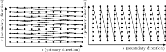
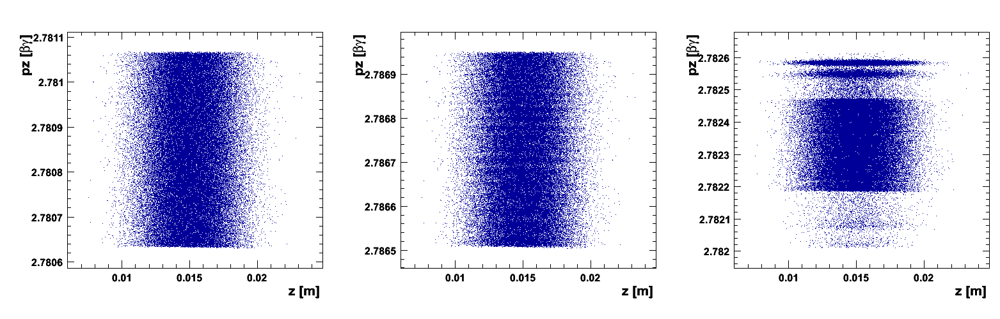

::::: {.feature-opalx}
## Current OPALX Field Maps {#opalx-field-maps}

OPALX selects a field-map reader from the file header. The current factory can
construct exactly four map types:

| Header descriptor | OPALX reader | Use |
|---|---|---|
| `2DMagnetoStatic` (`2DMa...`) | `FM2DMagnetoStatic` | two-dimensional static magnetic map |
| `2DDynamic` (`2DDy...`) | `FM2DDynamic` | two-dimensional time-dependent electromagnetic map |
| `AstraDynamic` (`AstraD...`) | `Astra1DDynamic` | non-equidistant ASTRA dynamic on-axis map |
| `AstraMagnetoStatic` (`AstraM...`) | `Astra1DMagnetoStatic` | non-equidistant ASTRA static magnetic on-axis map |

The descriptor is read from the beginning of the first non-comment record.
Comments begin with `#`.

### `AstraDynamic` and `AstraMagnetoStatic` {#opalx-astra-field-maps}

The ASTRA readers accept non-equidistant axial samples and construct an
equidistant internal spline representation. `AstraDynamic` starts with its
descriptor and Fourier coefficient count, followed by the frequency in `MHz`
and `(z [m], Ez [MV/m])` records. `AstraMagnetoStatic` contains `(z [m], Bz [T])`
records after its descriptor. Neither current reader provides the old `FAST`
path.

### `2DMagnetoStatic` {#opalx-2d-magnetostatic}

The header declares `XZ` or `ZX` ordering, followed by the two grid extents and
spacing counts. Samples contain `(Bz, Br)` in `XZ` order or `(Br, Bz)` in `ZX`
order. The reader uses bilinear interpolation and normalizes the on-axis
longitudinal field to a peak magnitude of `1 T` unless normalization is disabled
in the header.

### `2DDynamic` {#opalx-2d-dynamic}

This RF format declares `XZ` or `ZX` ordering, a longitudinal grid, frequency
in `MHz`, a radial grid, and four values per sample. In `XZ` order these are
`Ez`, `Er`, an unused magnitude column, and `Hphi`; the first two columns are
reversed in `ZX` order. Electric values are normalized to a peak on-axis
longitudinal field of `1 MV/m` unless normalization is disabled.

### Recognized but unsupported headers {#opalx-unsupported-field-map-headers}

The header parser still recognizes the following legacy prefixes, but the
current factory has no construction branch for them. They therefore fail when
an element tries to load the map and must not be used in OPALX:

| Recognized header | Parsed family |
|---|---|
| `1DDy...`, `1DMa...`, `1DPr...`, `1DEl...` | legacy one-dimensional maps and profiles |
| `2DEl...` | two-dimensional electrostatic map |
| `3DDy...`, `3DMa...`, `3DEl...` | legacy three-dimensional maps |
| H5hut/HDF5 field blocks | three-dimensional magnetic or dynamic block map |
| `AstraE...` | ASTRA electrostatic map |
| `1DPROFILE1-DEFAULT` | built-in legacy profile marker |

Recognition is not support: `Fieldmap::getFieldmap()` rejects all of these
types. This distinction reflects OPALX source commit `d1e762f15`.
:::::


::::: {.feature-opal}
## Introduction

This appendix documents the field-map types accepted by `OPAL-T`. The legacy
implementation supports several one-, two-, and three-dimensional field-map
formats that originated from different external codes and accelerator
applications.

The original manual groups them into three families:

1. 2D and 3D sampled field maps with interpolation on a grid
2. 1D on-axis profiles reconstructed off axis from a truncated Fourier series
3. Enge-function fringe-field models for selected bend magnets

In all cases, electric maps are normalized to a peak on-axis longitudinal field
of `1 MV/m` and magnetic maps to a peak on-axis longitudinal field of `1 T`,
unless the map type is explicitly documented as an exception.

## Comments in Field Maps

Comments are introduced by `#` and extend to the end of the line. They are
accepted:

- at the beginning of the file
- between data lines
- at the end of a complete data record

They must not split a record that is expected to stay on one line. A valid
example is:

```text
# This is a valid comment
1DMagnetoStatic 40 # This is also valid
-60.0 60.0 9999
# and this is valid too
0.0 2.0 199
```

A broken example is:

```text
1DMagnetoStatic # invalid split record
40
-60.0 60.0 # invalid inline split # 9999
0.0 2.0 199
```

## Normalization

ASCII field maps are normalized with the maximum absolute value of the
longitudinal on-axis field. The documented exception is `1DProfile1`. This
normalization can be disabled by appending `FALSE` to the first line of the
field map.

## Field-Map Warnings and Errors

If `OPAL-T` encounters a parsing error, it disables the corresponding element,
emits a warning, and continues the simulation. The main warning categories are:

- too few lines compared with the header counts
- too many lines compared with the header counts
- wrong number or type of values on a given line
- file not found
- unrecognized field-map descriptor
- too few Fourier coefficients for a 1D field reconstruction

For one-dimensional maps the reconstruction quality is checked with the legacy
criteria

$$
\frac{\sum_{i=1}^N (F_{z,i} - \tilde F_{z,i})^2}{\sum_{i=1}^N F_{z,i}^2} \le 10^{-2},
$$ {#eq-fieldmaps-rms-ratio}

and

$$
\frac{\max_i |F_{z,i} - \tilde F_{z,i}|}{\max_i |F_{z,i}|} \le 10^{-2},
$$ {#eq-fieldmaps-max-ratio}

where `F_z` is the sampled field from the file and `\tilde F_z` is the field
reconstructed after low-pass filtering.

## Types and Format

The legacy appendix lists both implemented and planned descriptors.

### Implemented families

| Type | Meaning |
|---|---|
| `1DMagnetoStatic` | one-dimensional static magnetic field |
| `AstraMagnetoStatic` | ASTRA magnetic field format with non-equidistant sampling |
| `1DDynamic` | one-dimensional time-dependent RF field |
| `AstraDynamic` | ASTRA dynamic field format |
| `1DProfile1` | Enge-like bend fringe profile |
| `2DElectroStatic` | two-dimensional electrostatic field |
| `2DMagnetoStatic` | two-dimensional static magnetic field |
| `2DDynamic` | two-dimensional dynamic field |
| `3DMagnetoStatic` | three-dimensional static magnetic field |
| `3DMagnetoStatic_Extended` | mid-plane magnetic field extended to 3D |
| `3DDynamic` | three-dimensional dynamic field |

### Planned but not implemented in the historical appendix

| Type | Note |
|---|---|
| `1DElectroStatic` | not implemented; old workaround was `1DDynamic` with very low frequency |
| `3DElectroStatic` | not implemented |

## Field-Map Orientation

Two- and three-dimensional maps carry an orientation string in the header.

For 2D maps:

- `XZ`: primary direction in `z`, secondary in `r`
- `ZX`: primary direction in `r`, secondary in `z`

For 3D maps:

- `XYZ`: primary direction in `z`, secondary in `y`, tertiary in `x`

The primary index increases fastest and the tertiary index slowest.
Accordingly, the first field component column corresponds to the primary
axis-order interpretation. For 2D dynamic maps in `XZ` orientation the four data
columns are:

- `Ez`
- `Er`
- `|E|` (unused by the legacy code)
- `Hphi`

In the alternative 2D orientation, the first two columns are interchanged while
the third and fourth are unchanged.

{#fig-fieldmaps-order width="60%"}

## `FAST` Attribute for 1D Field Maps

For some 1D field maps, the boolean attribute `FAST` can be used to speed up
field evaluation. When `FAST = TRUE`, `OPAL-T` generates an internal 2D field
map and then uses bilinear interpolation rather than the slower Fourier-series
technique.

This is faster, but the legacy appendix warns that it can introduce numerical
noise if the generated 2D grid is too coarse.

{#fig-fieldmaps-noise width="80%"}

## `1DMagnetoStatic`

A `1DMagnetoStatic` map stores one-dimensional static magnetic data on axis. An
example header from the appendix is:

```text
1DMagnetoStatic 40
-60.0 60.0 9999
0.0 2.0 199
```

This describes a map with `10000` longitudinal points (`9999` spacings) from
`-60 cm` to `60 cm` relative to `ELEMEDGE`. The field is normalized so that
`max(|B_on axis|) = 1 T`. The code computes `Nz/2` complex Fourier
coefficients and retains only `N_Fourier` during tracking.

If `FAST = TRUE`, the third line defines the radial range of an internally
generated 2D map. In the example, that is `0 cm` to `2 cm` with `200` radial
values.

| Line | Contents |
|---|---|
| 1 | `1DMagnetoStatic N_Fourier [TRUE|FALSE]` |
| 2 | `z_start z_end Nz` in cm |
| 3 | `r_start r_end Nr` in cm |
| remaining lines | `Bz` samples in tesla |

## `AstraMagnetoStatic`

This format accepts non-equidistant longitudinal samples in meters. The first
column is `z`, the second is the on-axis longitudinal magnetic field. `OPAL-T`
uses cubic-spline interpolation to resample the data to an equidistant mesh,
then computes Fourier coefficients from that internal mesh.

| Line | Contents |
|---|---|
| 1 | `AstraMagnetoStatic N_Fourier [TRUE|FALSE]` |
| remaining lines | `z_i [m]`, `Bz_i [T]` |

The appendix explicitly notes that `AstraMagnetoStatic` does not provide a
`FAST` path.

## `1DDynamic`

A `1DDynamic` map is the RF analogue of `1DMagnetoStatic`. An example header is:

```text
1DDynamic 40
-3.0 57.0 4999
1498.953425154
0.0 2.0 199
```

The field is sampled on axis, normalized so that
`max(|E_on axis|) = 1 MV/m`, and evaluated at runtime with the time factor
`cos(omega t + phi)`.

| Line | Contents |
|---|---|
| 1 | `1DDynamic N_Fourier [TRUE|FALSE]` |
| 2 | `z_start z_end Nz` in cm |
| 3 | frequency in MHz |
| 4 | `r_start r_end Nr` in cm for the optional `FAST` path |
| remaining lines | `Ez` samples in MV/m |

## `AstraDynamic`

`AstraDynamic` accepts a frequency line followed by non-equidistant `z` and
`Ez` samples in meters and MV/m. `OPAL-T` spline-resamples the data to an
internal equidistant mesh before the Fourier reconstruction.

| Line | Contents |
|---|---|
| 1 | `AstraDynamic N_Fourier [TRUE|FALSE]` |
| 2 | frequency in MHz |
| remaining lines | `z_i [m]`, `Ez_i [MV/m]` |

The appendix again notes that there is no `FAST` variant.

## `1DProfile1`

`1DProfile1` is the special bend-fringe profile format. It uses Enge functions
for the entrance and exit fringe fields [@spencerenge1967],

$$
F(z) = \frac{1}{1 + e^{\sum_{n=0}^{N_{\mathrm{order}}} c_n (z/D)^n}},
$$ {#eq-fieldmaps-enge-function}

where `D` is the full gap of the magnet and `c_n` are fitted coefficients.
Unlike the other ASCII formats, `1DProfile1` is not normalized to unit peak
field.

The appendix warns that the polynomial degree should be odd and the highest
coefficient should be positive, otherwise the fitted profile may turn upward
again at large distance.

{#fig-fieldmaps-enge width="80%"}

{#fig-fieldmaps-profile1 width="80%"}

The generic file layout is:

| Line | Contents |
|---|---|
| 1 | `1DProfile1 N_Enge_Entrance N_Enge_Exit Gap` |
| 2 | three entrance parameters plus a placeholder |
| 3 | three exit parameters plus a placeholder |
| following lines | entrance coefficients `c_0 ... c_N` then exit coefficients |

### `1DProfile1` Type 1

Type 1 stores the magnet length implicitly in the difference between the second
exit and entrance parameters. The appendix defines

$$
\begin{aligned}
\text{Entrance Parameter 1} &= \text{Entrance Parameter 2} - \Delta_1 \\
\text{Entrance Parameter 3} &= \text{Entrance Parameter 2} + \Delta_2 \\
\text{Exit Parameter 2} &= L - \text{Entrance Parameter 2} \\
\text{Exit Parameter 1} &= \text{Exit Parameter 2} - \Delta_3 \\
\text{Exit Parameter 3} &= \text{Exit Parameter 2} + \Delta_4
\end{aligned}
$$ {#eq-fieldmaps-profile1-type1-input}

and recovers internally

$$
\begin{aligned}
L &= \text{Exit Parameter 2} - \text{Entrance Parameter 2} \\
\Delta_1 &= \text{Entrance Parameter 2} - \text{Entrance Parameter 1} \\
\Delta_2 &= \text{Entrance Parameter 3} - \text{Entrance Parameter 2} \\
\Delta_3 &= \text{Exit Parameter 2} - \text{Exit Parameter 1} \\
\Delta_4 &= \text{Exit Parameter 3} - \text{Exit Parameter 2}.
\end{aligned}
$$ {#eq-fieldmaps-profile1-type1-recovered}

{#fig-fieldmaps-rbendtype1 width="60%"}

{#fig-fieldmaps-sbendtype1 width="60%"}

### `1DProfile1` Type 2

Type 2 removes the magnet-length information from the field map and uses the
beamline element attribute `L` instead. This allows the Enge origins to move
relative to the physical edges.

$$
\begin{aligned}
\text{Entrance Parameter 2} &= \text{perpendicular distance of the entrance Enge origin from the entrance edge}, \\
\text{Exit Parameter 2} &= \text{perpendicular distance of the exit Enge origin from the exit edge}.
\end{aligned}
$$ {#eq-fieldmaps-profile1-type2-origins}

The remaining deltas are still recovered from the parameter differences. The
two main advantages noted in the appendix are:

- the Enge origins can be adjusted to model the fringe more accurately
- one map can be reused for magnets with identical fringe fields but different
  lengths

## Two-Dimensional Families

### `2DElectroStatic`

Example header:

```text
2DElectroStatic XZ
-3.0 51.0 4999
0.0 2.0 199
0.00000e+00 0.00000e+00
4.36222e-06 0.00000e+00
...
```

This format describes a sampled electrostatic field with bilinear
interpolation. In the legacy workflow these maps were often produced with
Poisson Superfish [@billenyoung2004]. In the source example the map spans `5000` longitudinal points
and `200` radial points. The field is non-negligible from `-3.0 cm` to
`51.0 cm` relative to `ELEMEDGE`, and the radial support is `0.0 cm` to
`2.0 cm`. In `XZ` orientation the first column is `Ez` and the second is `Er`;
for `ZX` orientation the columns are exchanged.

| Line | Contents |
|---|---|
| 1 | `2DElectroStatic Orientation [TRUE|FALSE]` |
| 2 | fastest-changing axis extent and spacing count |
| 3 | slowest-changing axis extent and spacing count |
| remaining lines | `(Ez, Er)` for `XZ`, `(Er, Ez)` for `ZX` |

### `2DMagnetoStatic`

Example header:

```text
2DMagnetoStatic ZX
0.0 2.0 199
-3.0 51.0 4999
0.00000e+00 0.00000e+00
0.00000e+00 4.36222e-06
...
```

This is the magnetostatic analogue of `2DElectroStatic`. The field is
normalized so that `max(|Bz on axis|) = 1 T`. In the source example the
orientation is `ZX`, so the fastest-changing index is radial and the stored
pair is `(Br, Bz)` rather than `(Bz, Br)`.

| Line | Contents |
|---|---|
| 1 | `2DMagnetoStatic Orientation [TRUE|FALSE]` |
| 2 | fastest-changing axis extent and spacing count |
| 3 | slowest-changing axis extent and spacing count |
| remaining lines | `(Bz, Br)` for `XZ`, `(Br, Bz)` for `ZX` |

### `2DDynamic`

Example header:

```text
2DDynamic XZ
-3.0 51.0 4121
1498.953425154
0.0 1.0 75
0.00000e+00 0.00000e+00 0.00000e+00 0.00000e+00
...
```

This is the two-dimensional RF format. It adds a frequency line and stores four
values per grid point:

- `Ez`
- `Er`
- `|E|` (present but unused by `OPAL-T`)
- `Hphi`

The first two columns follow the `XZ` / `ZX` orientation rule, while the third
and fourth do not.

| Line | Contents |
|---|---|
| 1 | `2DDynamic Orientation [TRUE|FALSE]` |
| 2 | fastest-changing axis extent and spacing count |
| 3 | frequency in MHz |
| 4 | slowest-changing axis extent and spacing count |
| remaining lines | `Ez/Er`, `Er/Ez`, `|E|`, `Hphi` |

## Three-Dimensional Families

### `3DMagnetoStatic`

Example header:

```text
3DMagnetoStatic
-1.5 1.5 227
-1.0 1.0 151
-3.0 51.0 4121
0.00e+00 0.00e+00 0.00e+00
...
```

The plain 3D magnetostatic format stores full sampled vector-field data on a
Cartesian grid and uses trilinear interpolation. The legacy ordering is `z`
fastest, then `y`, then `x`. The data columns are `Bx`, `By`, and `Bz`.

| Line | Contents |
|---|---|
| 1 | `3DMagnetoStatic [TRUE|FALSE]` |
| 2 | `x_start x_end Nx` in cm |
| 3 | `y_start y_end Ny` in cm |
| 4 | `z_start z_end Nz` in cm |
| remaining lines | `Bx By Bz` |

### `3DMagnetoStatic_Extended`

Example header:

```text
3DMagnetoStatic_Extended
-9.9254 9.9254 133
-2.0 1.0 15
-22.425 47.425 465
-8.10970000e-05
...
```

This format stores only a mid-plane magnetic map and reconstructs the 3D field
using Maxwell consistency and a perfect-magnetic-conductor mid-plane symmetry.
The stored quantity is the perpendicular field component on the mid-plane, and
the upper half-plane is mirrored to negative `y`.

| Line | Contents |
|---|---|
| 1 | `3DMagnetoStatic_Extended [TRUE|FALSE]` |
| 2 | `x_start x_end Nx` in cm |
| 3 | `y_start y_end Ny` in cm |
| 4 | `z_start z_end Nz` in cm |
| remaining lines | stored mid-plane `By` values |

### `3DDynamic`

Example header:

```text
3DDynamic
1498.9534
-1.5 1.5 227
-1.0 1.0 151
-3.0 51.0 4121
0.00e+00 0.00e+00 0.00e+00 0.00e+00 0.00e+00 0.00e+00
...
```

The dynamic 3D format adds a frequency specification and then stores six field
components per sample:

- `Ex`
- `Ey`
- `Ez`
- `Hx`
- `Hy`
- `Hz`

The grid ordering is again `z` fastest, then `y`, then `x`.

| Line | Contents |
|---|---|
| 1 | `3DDynamic [TRUE|FALSE]` |
| 2 | frequency in MHz |
| 3 | `x_start x_end Nx` in cm |
| 4 | `y_start y_end Ny` in cm |
| 5 | `z_start z_end Nz` in cm |
| remaining lines | `Ex Ey Ez Hx Hy Hz` |

::::::
