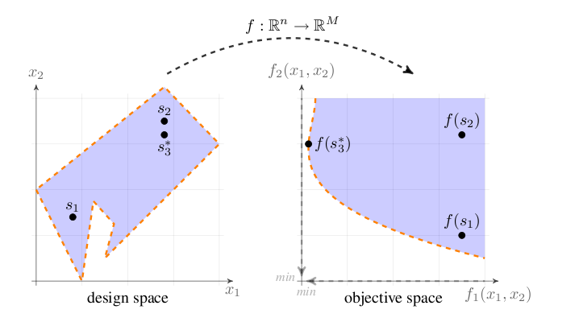

::: {.feature-opal}
Optimization problems with more than one criterion are treated in `OPAL` as
multi-objective optimization problems. The legacy implementation is based on
`opt-pilot`, integrated into `OPAL`.

## Definition

A general multi-objective optimization problem is written as

$$
\begin{aligned}
\min \quad & f_m(\mathbf{x}),        & m &= \{1, \ldots, M\}, \\
\text{subject to} \quad & g_j(\mathbf{x}) \ge 0, & j &= \{1, \ldots, J\}, \\
& -\infty \le x_i^L \le x_i \le x_i^U \le \infty, & i &= \{0, \ldots, n\}.
\end{aligned}
$$ {#eq-optimiser-definition}

The objectives are minimized over a bounded design space, optionally subject to
constraints. `OPAL` treats the mapping from design variables to objective space
as a black-box evaluation driven by accelerator simulations.

{#fig-optimiser-design-objective-space width="70%"}

## Pareto Optimality

In most practical cases the objectives are conflicting, so no single design
point minimizes all objectives at once. The optimization therefore seeks a set
of non-dominated points approximating the Pareto front.

The legacy discussion emphasizes the dominance relation:

- a solution dominates another if it is no worse in all objectives
- and strictly better in at least one objective

This is the ordering relation that drives the multi-objective search.

{#fig-optimiser-pareto-defs width="100%"}

## MOGA Theory

The chapter frames the optimizer as a multi-objective genetic algorithm
workflow. The focus is practical rather than theoretical: population
management, mutation, crossover, and evaluation of the objective and constraint
expressions on top of ordinary `OPAL` simulations.

## Optimiser OPAL Commands

The optimization workflow is defined by:

- `DVAR` for design variables
- `OBJECTIVE` for the quantities to minimize
- `CONSTRAINT` for admissibility conditions
- `OPTIMIZE` for the optimization run itself

### Basic Syntax

Design variables are introduced one by one:

```text
d1: DVAR, VARIABLE="x1", LOWERBOUND=-1.0, UPPERBOUND=1.0;
d2: DVAR, VARIABLE="x2", LOWERBOUND=-1.0, UPPERBOUND=1.0;
d3: DVAR, VARIABLE="x3", LOWERBOUND=-1.0, UPPERBOUND=1.0;
```

Objectives are then defined as expressions to minimize:

```text
obj1: OBJECTIVE, EXPR="-statVariableAt('energy', 1.0)";
obj2: OBJECTIVE, EXPR="statVariableAt('emit_x', 1.0)";
```

and constraints in the same expression language:

```text
con1: CONSTRAINT, EXPR="statVariableAt('rms_x', 1.0) < 1.0";
con2: CONSTRAINT, EXPR="statVariableAt('numParticles', 1.0) > 1000";
```

Template files must contain placeholder variables such as `_x1_` for the
corresponding `DVAR` entries.

### `OPTIMIZE` Command

`OPTIMIZE` starts the optimization run.

Important attributes include:

| Attribute | Meaning |
|---|---|
| `INPUT` | Path to the template or input file |
| `OUTPUT` | Base name for generated result files |
| `OUTDIR` | Output directory for generations and results |
| `OBJECTIVES` | List of objective definitions |
| `DVARS` | List of design variables |
| `CONSTRAINTS` | List of constraints |
| `INITIALPOPULATION` | Initial population size |
| `STARTPOPULATION` | Optional restart population in JSON format |
| `NUM_MASTERS` | Number of master ranks |
| `NUM_COWORKERS` | Number of worker ranks per individual |
| `DUMP_DAT` | Dump legacy plain-text generation format |
| `DUMP_FREQ` | Generation dump frequency |
| `DUMP_OFFSPRING` | Dump offspring instead of parents |
| `NUM_IND_GEN` | Individuals per generation |
| `MAXGENERATIONS` | Maximum number of generations |
| `EPSILON` | Hypervolume tolerance |
| `EXPECTED_HYPERVOL` | Reference hypervolume |
| `HYPERVOLREFERENCE` | Hypervolume reference point |
| `CONV_HVOL_PROG` | Hypervolume-based convergence threshold |
| `ONE_PILOT_CONVERGE` | Single-pilot convergence mode |
| `SOL_SYNCH` | Solution-exchange frequency |
| `INITIAL_OPTIMIZATION` | Speed up generation of the first population |
| `BIRTH_CONTROL` | Enforce strict population sizes |
| `MUTATION_PROBABILITY` | Mutation probability per individual |
| `MUTATION` | Mutation type |
| `GENE_MUTATION_PROBABILITY` | Mutation probability per gene |
| `RECOMBINATION_PROBABILITY` | Crossover probability |
| `CROSSOVER` | Crossover model |
| `SIMBIN_CROSSOVER_NU` | Simulated binary crossover parameter |
| `SIMTMPDIR` | Simulation scratch directory |
| `TEMPLATEDIR` | Template directory |
| `FIELDMAPDIR` | Field-map directory |
| `DISTDIR` | Distribution directory |
| `RESTART_FILE` | Optional H5 restart file |
| `RESTART_STEP` | Restart step inside the H5 restart file |

### `DVAR` Command

`DVAR` defines a design variable.

| Attribute | Meaning |
|---|---|
| `VARIABLE` | Variable name used in the template |
| `LOWERBOUND` | Lower admissible value |
| `UPPERBOUND` | Upper admissible value |

### `OBJECTIVE` Command

`OBJECTIVE` defines one quantity to minimize.

| Attribute | Meaning |
|---|---|
| `EXPR` | Objective expression |

### `CONSTRAINT` Command

`CONSTRAINT` defines one admissibility condition.

| Attribute | Meaning |
|---|---|
| `EXPR` | Constraint expression |

### Available Expressions

The expression language supports both ordinary mathematical functions and data
accessors for simulation output.

Standard mathematical functions include:

- `sqrt`
- `pow`
- `exp`
- `log`
- `ceil`
- `floor`
- `fabs`
- `fmod`
- `sin`
- `asin`
- `cos`
- `acos`
- `tan`
- `atan`
- `sq`

The legacy manual also documents output-access functions such as:

- `fromFile(file)`
- `sddsVariableAt(var, refpos, sdds_file)`
- `sddsVariableAt(var, refvar, refpos, sdds_file)`
- `statVariableAt(var, refpos)`
- `statVariableAt(var, refvar, refpos)`
- `sumErrSq(meas_file, var_name, sdds_file)`
- `radialPeak(file, turn)`
- `sumErrSqRadialPeak(meas_file, sim_file, begin, end)`
- `probVariableWithID(var, id, probe_file)`
- `septum(probe)`

These allow optimization directly against `.stat`, SDDS, probe, and
measurement-derived quantities.

### Example Input File

The original manual includes a full example based on the files
[05-DL_QN3.in](examples/05-DL_QN3.in) and
[tmpl/05-DL_QN3.tmpl](examples/tmpl/05-DL_QN3.tmpl). The example optimizes three
quadrupole strengths through `DVAR` definitions, evaluates beam statistics as
objectives, and runs `OPTIMIZE` with a small initial population and generation
count.

The corresponding runtime pattern is:

```text
OPTIMIZE, INPUT="tmpl/05-DL_QN3.tmpl", OBJECTIVES={...}, DVARS={...},
          INITIALPOPULATION=5, MAXGENERATIONS=3, NUM_IND_GEN=3,
          NUM_MASTERS=1, NUM_COWORKERS=1, TEMPLATEDIR="tmpl",
          FIELDMAPDIR="fieldmaps", OUTPUT="optLinac", OUTDIR="results";
```

### Output

The optimizer writes generation data in JSON format and optionally in the
legacy plain-text format. The Pareto-front data are written to
`ParetoFront_.json`, while runtime logs such as `opt.trace.0`,
`opt-progress.0`, and `pilot.trace.0` record job dispatch and validity.
:::

::: {.feature-opalx}
This optimization feature is not yet available in OPALX. The OPAL view is
retained as a compatibility reference and a reminder of intended future
functionality.
:::
