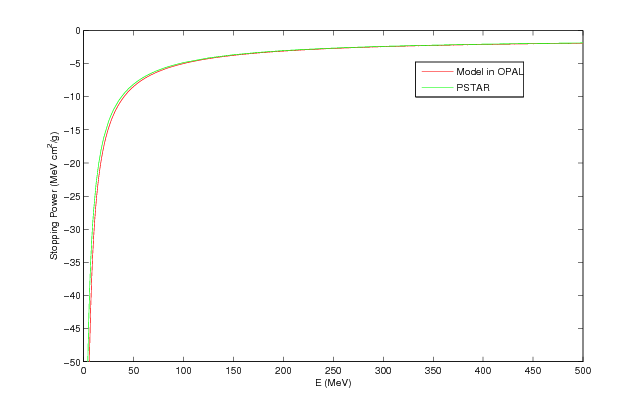
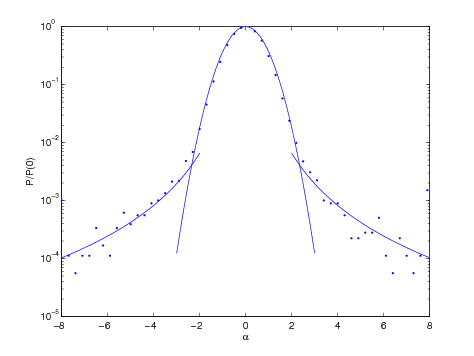
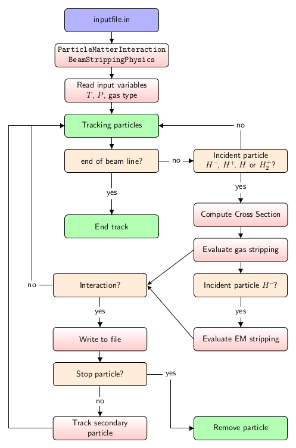
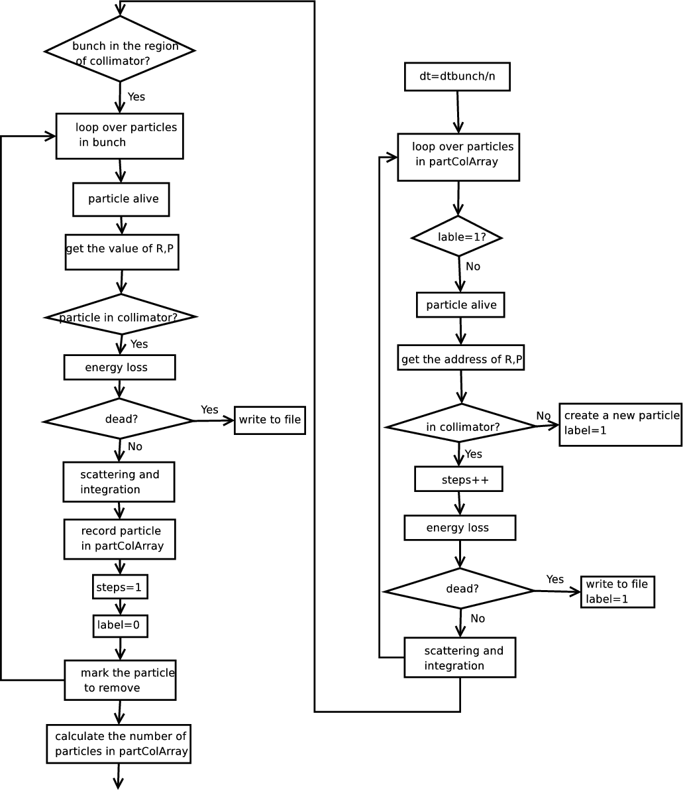
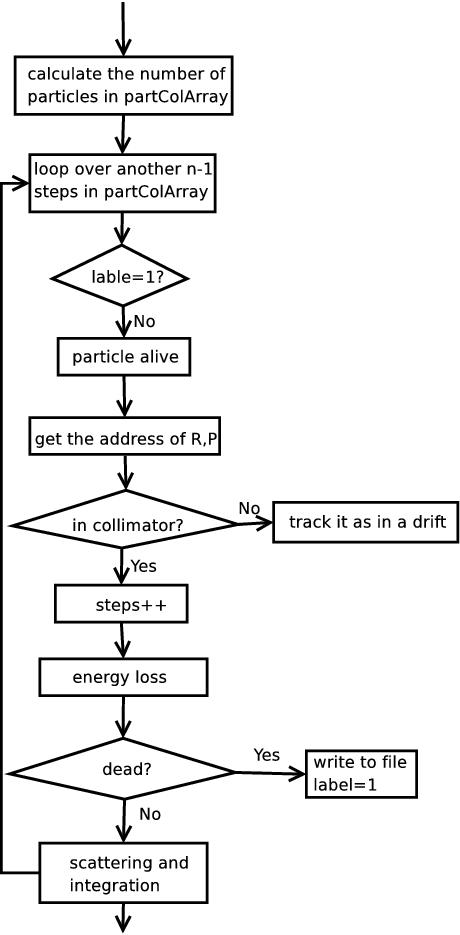

::: {.feature-opalx}
`PARTICLEMATTERINTERACTION` is not registered by the current OPALX executable.
Internal material and scattering classes are not a user-facing replacement.
The OPAL view preserves the complete legacy interface and model description.
:::

::: {.feature-opal}
Particle-matter interactions are defined through
`PARTICLEMATTERINTERACTION`.

## Command Overview

The core attributes are:

| Attribute | Meaning |
|---|---|
| `TYPE` | Interaction handler: `SCATTERING` or `BEAMSTRIPPING` |
| `MATERIAL` | Surface or medium material |
| `ENABLERUTHERFORD` | Enable or disable large-angle Rutherford scattering |
| `LOWENERGYTHR` | Low-energy cutoff in MeV; particles below this are removed |

The resulting interaction model is then attached to beamline elements that
represent material boundaries or residual-gas regions.

## The Energy Loss

The mean ionization energy loss is modeled with the Bethe-Bloch equation,

$$
-\frac{dE}{dx} = \frac{K z^2 Z}{A \beta^2}
\left[
\frac{1}{2}\ln\left(\frac{2 m_e c^2 \beta^2 \gamma^2 T_{\max}}{I^2}\right)
- \beta^2
\right],
$$ {#eq-partmatter-bethe-bloch}

where `Z`, `A`, `I`, `beta`, `gamma`, and `Tmax` have their usual stopping
power meaning and

$$
T_{\max} =
\frac{2 m_e c^2 \beta^2 \gamma^2}
{1 + 2 \gamma m_e/M + (m_e/M)^2}.
$$ {#eq-partmatter-tmax}

The manual states that this form is used for incident `PROTON`, `DEUTERON`,
`MUON`, `HMINUS`, and `H2P` beams over the documented energy ranges, and also
for `ALPHA` particles in their supported range.

{#fig-partmatter-pstar width="70%"}

At low energy the stopping power is switched to Andersen-Ziegler-style
semi-empirical fits. The implementation also models energy straggling with a
Gaussian width

$$
\sigma_0^2 =
4 \pi N_A r_e^2 (m_e c^2)^2 \rho \frac{Z}{A} \Delta s.
$$ {#eq-partmatter-straggling}

Particles whose remaining energy drops below `LOWENERGYTHR` are removed and
written to the corresponding loss file.

## The Coulomb Scattering

The Coulomb-scattering model is split into:

- multiple Coulomb scattering
- large-angle Rutherford scattering

The distributions are written in the legacy manual as

$$
P_M(\alpha)\, d\alpha = \frac{1}{\sqrt{\pi}} e^{-\alpha^2}\, d\alpha
$$ {#eq-partmatter-pm}

and

$$
P_S(\alpha)\, d\alpha =
\frac{1}{8 \ln(204 Z^{-1/3})} \frac{1}{\alpha^3}\, d\alpha,
$$ {#eq-partmatter-ps}

with transition scale

$$
\theta_0 = \frac{13.6\,\mathrm{MeV}}{\beta c p}\, z
\sqrt{\Delta s / X_0}\, [1 + 0.038 \ln(\Delta s / X_0)].
$$ {#eq-partmatter-theta0}

### Multiple Coulomb Scattering

For the multiple-scattering branch, independent Gaussian random variables are
used to update both transverse coordinates and transverse momenta over the
substep. The model gives the cumulative small-angle deflection caused by many
soft collisions in the material.

### Large Angle Rutherford Scattering

The rare large-angle tail is handled separately as a Rutherford-scattering
process. The legacy implementation samples this branch probabilistically and
then draws the corresponding scattering angle from the cumulative
distribution.

{#fig-partmatter-jackson width="70%"}

## Beam Stripping Physics

Beam stripping covers:

- interaction with residual gas
- electromagnetic or Lorentz stripping

The common stochastic model assumes a mean free path `lambda` and interaction
probability

$$
P(x) = 1 - e^{-x/\lambda}.
$$ {#eq-partmatter-strip-prob}

{#fig-partmatter-beamstripping width="70%"}

### Residual Gas Interaction

For a gas mixture, the total inverse mean free path is the sum of the
component-wise contributions. The implementation supports charge-exchange and
electron-detachment or capture reactions for the incoming species documented in
the legacy manual:

- `HMINUS`
- `PROTON`
- `HYDROGEN`
- `H2P`
- `DEUTERON`

The cross sections are fitted from experimental data with different families of
analytic expressions depending on projectile and target:

- Nakai function
- Tabata function
- Barnett function
- Bohr function

### Electromagnetic Stripping

For `HMINUS`, the model also accounts for magnetic-field-induced dissociation.
The transverse magnetic field from the cyclotron map produces a rest-frame
electric field through

$$
E = \gamma \beta c B.
$$ {#eq-partmatter-lorentz-field}

The stripping fraction during a time step `dt` is then

$$
f_{\mathrm{em}} = 1 - e^{-dt / (\gamma \tau)}.
$$ {#eq-partmatter-em-strip}

The manual explicitly restricts this electromagnetic stripping path to
`OPAL-cycl`.

## The `ScatteringPhysics` Substeps

The implementation uses internal substeps when the main tracking step is too
large for accurate material-interaction physics. In the legacy code path,
`ScatteringPhysics.cpp` subdivides the step so that the material-interaction
substep stays below the documented threshold. Particles already inside the
element and particles entering the element are then advanced consistently over
the same physical time interval.

{#fig-partmatter-scatteringphysics-1 width="70%"}

{#fig-partmatter-scatteringphysics-2 width="30%"}

## Available Materials in OPAL

The material database includes the standard beamline materials listed in the
legacy manual, among them:

- `Air`
- `Aluminum`
- `AluminaAl2O3`
- `Beryllium`
- `BoronCarbide`
- `Copper`
- `Gold`
- `Graphite`
- `GraphiteR6710`
- `Kapton`
- `Molybdenum`
- `Mylar`
- `Titanium`
- `Water`

For each material the original manual provides:

- atomic number `Z`
- atomic weight `A`
- mass density `rho`
- radiation length `X0`
- mean excitation energy `I`
- Andersen-Ziegler low-energy fit coefficients

### Material properties

| Material | `Z` | `A` | `rho [g/cm^3]` | `X0 [g/cm^2]` | `I [eV]` |
|---|---:|---:|---:|---:|---:|
| `Air` | 7 | 14 | 1.205e-3 | 36.62 | 85.7 |
| `Aluminum` | 13 | 26.9815384 | 2.699 | 24.01 | 166.0 |
| `AluminaAl2O3` | 50 | 101.9600768 | 3.97 | 27.94 | 145.2 |
| `Beryllium` | 4 | 9.0121831 | 1.848 | 65.19 | 63.7 |
| `BoronCarbide` | 26 | 55.251 | 2.52 | 50.13 | 84.7 |
| `Copper` | 29 | 63.546 | 8.96 | 12.86 | 322.0 |
| `Gold` | 79 | 196.966570 | 19.32 | 6.46 | 790.0 |
| `Graphite` | 6 | 12.0172 | 2.210 | 42.7 | 78.0 |
| `GraphiteR6710` | 6 | 12.0172 | 1.88 | 42.7 | 78.0 |
| `Kapton` | 6 | 12 | 1.420 | 40.58 | 79.6 |
| `Molybdenum` | 42 | 95.95 | 10.22 | 9.80 | 424.0 |
| `Mylar` | 6.702 | 12.88 | 1.400 | 39.95 | 78.7 |
| `Titanium` | 22 | 47.867 | 4.540 | 16.16 | 233.0 |
| `Water` | 10 | 18.0152 | 1.0 | 36.08 | 75.0 |

### Andersen-Ziegler coefficients

| Material | `A1` | `A2` | `A3` | `A4` | `A5` | `B1` | `B2` | `B3` | `B4` | `B5` |
|---|---:|---:|---:|---:|---:|---:|---:|---:|---:|---:|
| `Air` | 2.954 | 3.350 | 1.683e3 | 1.900e3 | 2.513e-2 | 1.9259 | 0.5550 | 27.15125 | 26.0665 | 6.2768 |
| `Aluminum` | 4.154 | 4.739 | 2.766e3 | 1.645e2 | 2.023e-2 | 2.5 | 0.625 | 45.7 | 0.1 | 4.359 |
| `AluminaAl2O3` | 1.187e1 | 1.343e1 | 1.069e4 | 7.723e2 | 2.153e-2 | 5.4 | 0.53 | 103.1 | 3.931 | 7.767 |
| `Beryllium` | 2.248 | 2.590 | 9.660e2 | 1.538e2 | 3.475e-2 | 2.1895 | 0.47183 | 7.2362 | 134.30 | 197.96 |
| `BoronCarbide` | 3.519 | 3.963 | 6065.0 | 1243.0 | 7.782e-3 | 5.013 | 0.4707 | 85.8 | 16.55 | 3.211 |
| `Copper` | 3.969 | 4.194 | 4.649e3 | 8.113e1 | 2.242e-2 | 3.114 | 0.5236 | 76.67 | 7.62 | 6.385 |
| `Gold` | 4.844 | 5.458 | 7.852e3 | 9.758e2 | 2.077e-2 | 3.223 | 0.5883 | 232.7 | 2.954 | 1.05 |
| `Graphite` | 0.0 | 2.601 | 1.701e3 | 1.279e3 | 1.638e-2 | 3.80133 | 0.41590 | 12.9966 | 117.83 | 242.28 |
| `GraphiteR6710` | 0.0 | 2.601 | 1.701e3 | 1.279e3 | 1.638e-2 | 3.80133 | 0.41590 | 12.9966 | 117.83 | 242.28 |
| `Kapton` | 0.0 | 2.601 | 1.701e3 | 1.279e3 | 1.638e-2 | 3.83523 | 0.42993 | 12.6125 | 227.41 | 188.97 |
| `Molybdenum` | 6.424 | 7.248 | 9.545e3 | 4.802e2 | 5.376e-3 | 9.276 | 0.418 | 157.1 | 8.038 | 1.29 |
| `Mylar` | 2.954 | 3.350 | 1683 | 1900 | 2.513e-2 | 1.9259 | 0.5550 | 27.15125 | 26.0665 | 6.2768 |
| `Titanium` | 4.858 | 5.489 | 5.260e3 | 6.511e2 | 8.930e-3 | 4.71 | 0.5087 | 65.28 | 8.806 | 5.948 |
| `Water` | 4.015 | 4.542 | 3.955e3 | 4.847e2 | 7.904e-3 | 2.9590 | 0.53255 | 34.247 | 60.655 | 15.153 |

## Example of an Input File

The original manual points to
[particlematterinteraction.in](examples/particlematterinteraction.in) as the
reference input deck. It combines material elements with collimator-style
aperture settings and a particle-matter interaction definition.

## A Simple Test

The documented benchmark uses a cold Gaussian beam passing through a copper
slit or elliptic collimator and compares both absorbed and scattered
populations as well as the downstream energy and angular spectra.

{#fig-partmatter-protons-collimator width="80%"}

{#fig-partmatter-spectrum width="80%"}
:::
